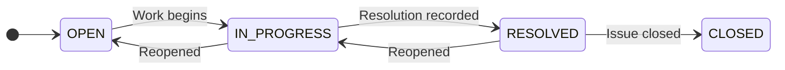
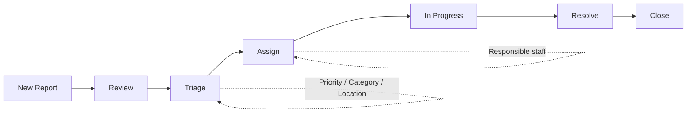
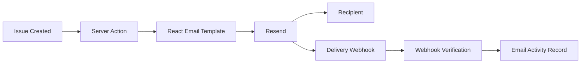
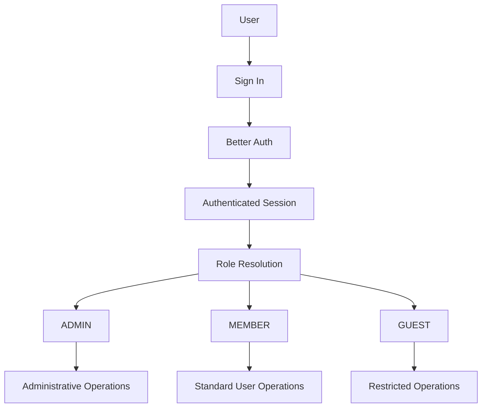
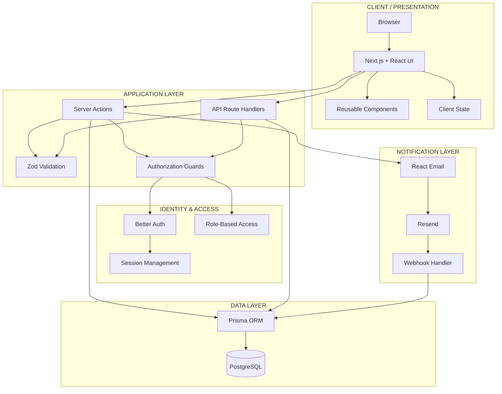
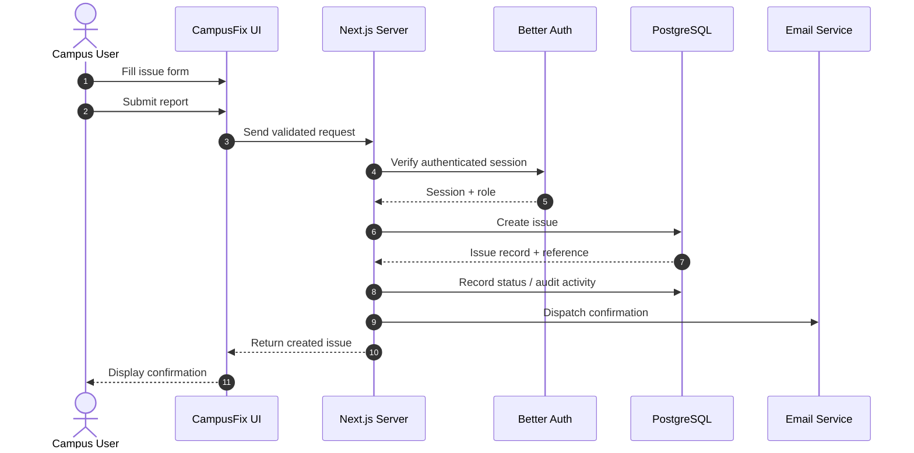
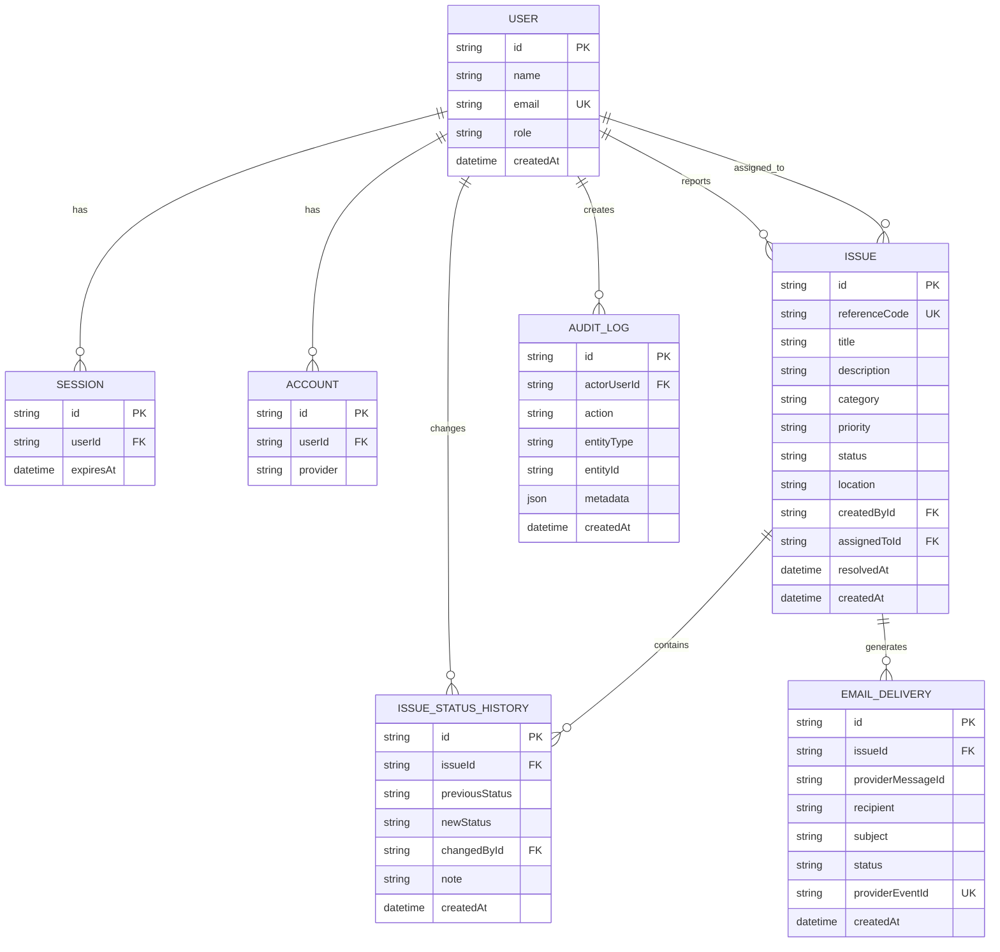
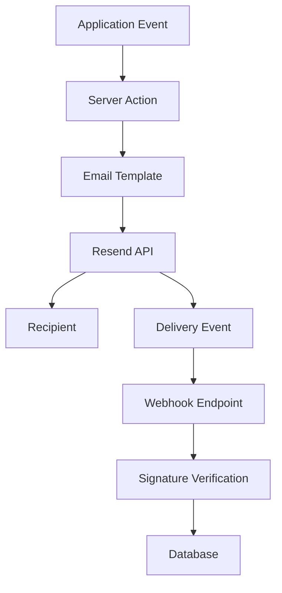
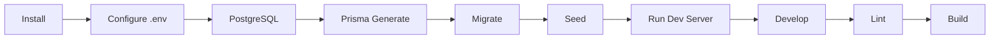

<div align="center">


# CAMPUSFIX

### Campus infrastructure, reported. Assigned. Resolved.

**A unified digital platform for reporting, triaging, assigning, tracking, and resolving campus infrastructure issues.**

<br />

[](https://nextjs.org/)
[](https://react.dev/)
[](https://www.typescriptlang.org/)
[](https://www.postgresql.org/)
[](https://www.prisma.io/)
[](https://tailwindcss.com/)

<br />

[**Overview**](#-overview) ·
[**Features**](#-features) ·
[**Architecture**](#-architecture) ·
[**Database**](#-data-model) ·
[**Security**](#-security) ·
[**Setup**](#-getting-started)

</div>

---

# ✦ Overview

CampusFix is a campus infrastructure operations platform built to replace
fragmented issue-reporting channels with a structured, trackable workflow.

A campus user can report an infrastructure problem with its location,
category, priority, and description. Facilities teams can then review the
incoming issue, triage it, assign responsibility, update its status, and
follow its progress until resolution.

Every important operation is associated with the issue's lifecycle and can be
recorded for later inspection.

```text
┌───────────────────────────────────────────────────────────────────────┐
│                            CAMPUSFIX                                  │
├───────────────────────────────────────────────────────────────────────┤
│                                                                       │
│   CAMPUS USER                         FACILITIES TEAM                 │
│       │                                      │                        │
│       │ Report issue                         │ View queue             │
│       ▼                                      ▼                        │
│   Categorize ──────────────────────────►Triage                        │
│       │                                      │                        │
│       │ Priority + Location                  │ Assign                 │
│       ▼                                      ▼                        │
│     Submit ───────────────────────────►Work in progress               │
│                                              │                        │
│                                              ▼                        │
│                                           Resolve                     │
│                                              │                        │
│                         ┌────────────────────┘                        │
│                         ▼                                             │
│                  History + Audit                                      │
│                                                                       │
└───────────────────────────────────────────────────────────────────────┘
```

The platform is designed around a simple operational principle:

> **Make the current state of every campus issue obvious — and make the next action easy.**

---

# ⚡ Why CampusFix?

Campus infrastructure issues are operational events.

A damaged facility, electrical fault, plumbing problem, HVAC failure, safety
concern, or other infrastructure issue needs more than a message sitting in
someone's inbox.

CampusFix converts the report into a structured operational record with:

- a unique issue reference
- category and priority
- campus location
- reporter information
- assignment ownership
- lifecycle status
- status history
- audit activity
- transactional notifications

This creates a single workflow from the initial report to resolution.

---

# ✦ Core Capabilities

## 01 — Issue Reporting

Campus users can create structured infrastructure reports containing:

- Issue title
- Description
- Category
- Priority
- Campus location
- Reporter
- Creation timestamp
- Unique reference code

Each issue receives a human-readable reference such as:

```text
CFX-8948
```

This reference can be used to identify and track the issue throughout its
lifecycle.

---

## 02 — Centralized Issue Workspace

The main workspace provides an operational view of campus incidents.

### Issue workspace capabilities

- All Issues
- My Issues
- Search
- Status filters
- Priority filters
- Category filters
- Location search
- Reference-code search
- Status indicators
- Priority indicators
- Issue detail drawer
- Chronological activity history

The detail drawer allows an issue to be inspected without losing the context
of the underlying issue queue.

---

## 03 — Controlled Issue Lifecycle

Issues move through a defined operational lifecycle.



The interface exposes lifecycle actions according to the authenticated user's
authorization level.

---

# 🏢 Facilities Operations

CampusFix provides a dedicated operational workspace for facilities teams.

The administration area focuses on the work that needs to happen rather than
exposing raw database operations.

## Operations Overview

The operational overview can surface:

- Open issues
- In-progress issues
- Resolved issues
- Total issue activity
- Recent reports
- Recent operational activity
- Priority distribution

---

## Triage & Assignment

Facilities operators can process incoming reports through a dedicated
triage workflow.



The objective is to make ownership explicit.

```text
Incoming Report
       │
       ▼
     Triage
       │
       ▼
    Assigned
       │
       ▼
   In Progress
       │
       ▼
    Resolved
       │
       ▼
     Closed
```

---

# 👤 User & Access Management

CampusFix separates authentication from authorization.

Users authenticate into the platform and are then granted capabilities based
on their role.

| Role | Scope |
|---|---|
| `ADMIN` | Administrative and facilities operations |
| `MEMBER` | Standard authenticated campus access |
| `GUEST` | Restricted access |

Role changes are treated as auditable operations.

---

# 🛡️ Audit Trail

Important system operations can be recorded in the audit system.

Representative events include:

```text
ISSUE_CREATED
STATUS_CHANGED
ISSUE_ASSIGNED
USER_ROLE_CHANGED
```

An audit entry can preserve:

| Field | Purpose |
|---|---|
| Actor | User responsible for the event |
| Action | Operation performed |
| Entity type | Type of affected resource |
| Entity ID | Identifier of the affected resource |
| Metadata | Additional event information |
| Timestamp | Time of the event |

This provides an operational history rather than relying only on the current
state of an issue.

---

# ✉️ Transactional Email

CampusFix integrates transactional email into the issue lifecycle.

The notification architecture separates application logic from email
delivery infrastructure.



This allows delivery activity to be represented inside the operational
workspace instead of treating email as an invisible external process.

---

# 🔐 Authentication & Authorization

Authentication and authorization are intentionally separated.



The application uses server-side authorization checks for privileged
operations rather than relying only on whether a control happens to be
visible in the browser.

Input boundaries are additionally protected through schema validation.

---

# 🎨 Product Experience

CampusFix is intentionally designed as an operational workspace rather than
a generic CRUD dashboard.

The interface emphasizes:

- clear hierarchy
- strong typography
- structured information
- compact status indicators
- predictable navigation
- responsive layouts
- keyboard accessibility
- subtle motion
- light and dark themes
- reusable interface primitives

The default experience is **light mode**.

Dark mode is available through the application's theme system.

---

# ✨ Interaction System

## Command Palette

CampusFix provides keyboard-oriented navigation through a command palette.

```text
Ctrl / Cmd + K
```

This provides a fast way to discover navigation and application actions.

---

## Keyboard Shortcuts

The interface supports contextual shortcuts including:

```text
/       Search
n       New issue
?       Shortcut help
[       Toggle sidebar
Esc     Close / dismiss
```

Keyboard controls complement the normal interface and do not replace
conventional navigation.

---

## Issue Detail Drawer

Issue details can be inspected in a side drawer containing information such as:

```text
┌───────────────────────────────────────────┐
│ ISSUE DETAIL                              │
├───────────────────────────────────────────┤
│ Reference                                 │
│ CFX-8948                                  │
│                                           │
│ Title                                     │
│ Intermittent power trip                   │
│                                           │
│ Status        Priority                    │
│ In Progress   High                        │
│                                           │
│ Location                                  │
│ Technology Tower · 3rd floor              │
│                                           │
│ Reporter       Assignee                   │
│ Campus User    Facilities Team            │
│                                           │
│ Activity                                  │
│ ● Created                                 │
│ │                                         │
│ ● Triaged                                 │
│ │                                         │
│ ● Assigned                                │
│ │                                         │
│ ● In Progress                             │
└───────────────────────────────────────────┘
```

This interaction preserves the user's position in the issue list.

---

# 🌊 Visual Identity

CampusFix uses a wrench-and-campus visual identity representing the relationship
between campus infrastructure and maintenance operations.

```text
             CAMPUS
                │
                ▼
        INFRASTRUCTURE
                │
                ▼
          MAINTENANCE
                │
                ▼
           CAMPUSFIX
```

The landing and authentication experience can use the project's Particle
Drift visual treatment to create a more expressive entry point.

The operational workspace remains focused on clarity and information density.

> **Expressive at the entry point. Efficient inside the workspace.**

---

# 🧭 Architecture

CampusFix follows a layered Next.js application architecture.



---

# 🔄 End-to-End Request Flow

The following sequence represents the core issue-creation path.



---

# 🧱 Application Boundaries

The application can be understood through the following boundaries:

```text
┌──────────────────────────────────────────────────────────────┐
│                         PRESENTATION                         │
│                                                              │
│  Pages · Layouts · Drawers · Forms · Tables · Components     │
│                                                              │
└──────────────────────────────┬───────────────────────────────┘
                               │
                               ▼
┌──────────────────────────────────────────────────────────────┐
│                       APPLICATION                            │
│                                                              │
│  Server Actions · API Routes · Validation · Authorization    │
│                                                              │
└──────────────────────────────┬───────────────────────────────┘
                               │
                               ▼
┌──────────────────────────────────────────────────────────────┐
│                         DOMAIN                               │
│                                                              │
│  Issues · Users · Status · Assignment · Audit · Email        │
│                                                              │
└──────────────────────────────┬───────────────────────────────┘
                               │
                               ▼
┌──────────────────────────────────────────────────────────────┐
│                        PERSISTENCE                           │
│                                                              │
│               Prisma ORM → PostgreSQL                        │
│                                                              │
└──────────────────────────────────────────────────────────────┘
```

---

# 🗃️ Data Model

CampusFix uses PostgreSQL for persistent relational storage and Prisma for
type-safe database access.

The primary data domains include:

- Users
- Sessions
- Accounts
- Issues
- Issue status history
- Audit logs
- Email delivery records

The authoritative database definition lives in:

```text
prisma/schema.prisma
```

Database migrations are maintained under:

```text
prisma/migrations/
```

---

# 🧬 Entity Relationship Model



> **Schema note:** The diagram above is a high-level representation of the
> application's data relationships. The actual Prisma schema remains the
> source of truth for field definitions, constraints, indexes, and migrations.

---

# 🔑 Role-Based Access Model

CampusFix uses role-based access to separate standard campus activity from
administrative operations.

| Capability | ADMIN | MEMBER | GUEST |
|---|:---:|:---:|:---:|
| View issues | ✓ | ✓ | ✓ |
| Inspect issue details | ✓ | ✓ | ✓ |
| View issue history | ✓ | ✓ | ✓ |
| Submit an issue | ✓ | ✓ | — |
| View personal issues | ✓ | ✓ | — |
| Access administration | ✓ | — | — |
| Triage issues | ✓ | — | — |
| Assign issues | ✓ | — | — |
| Update operational status | ✓ | — | — |
| Manage user roles | ✓ | — | — |
| Review audit activity | ✓ | — | — |
| Inspect email activity | ✓ | — | — |

> Permissions are enforced by the application's authorization layer. The
> visibility of a UI control is not treated as the security boundary.

---

# 📦 Technology Stack

| Layer | Technology | Responsibility |
|---|---|---|
| Framework | Next.js | Application framework and routing |
| UI | React | Component-based interface |
| Language | TypeScript | Static typing |
| Styling | Tailwind CSS | Design system and utility styling |
| Components | Radix UI | Accessible interface primitives |
| Icons | Lucide React | Interface iconography |
| Database | PostgreSQL | Persistent relational storage |
| ORM | Prisma | Type-safe database access |
| Authentication | Better Auth | Authentication and sessions |
| State | Zustand | Client-side state |
| Forms | React Hook Form | Form state and submission |
| Validation | Zod | Runtime schema validation |
| Email UI | React Email | Transactional email templates |
| Email Delivery | Resend | Transactional delivery |
| Webhooks | Svix | Webhook signature verification |

Dependency versions should always be taken from the repository's
`package.json` rather than copied from documentation.

---

# 📁 Repository Structure

```text
CampusFix/
│
├── actions/
│   ├── admin-actions.ts
│   └── issue-actions.ts
│
├── app/
│   ├── (auth)/
│   │   ├── sign-in/
│   │   └── sign-up/
│   │
│   ├── admin/
│   │   ├── audit/
│   │   ├── email/
│   │   ├── issues/
│   │   └── users/
│   │
│   ├── api/
│   │   ├── admin/
│   │   ├── auth/
│   │   ├── issues/
│   │   └── webhooks/
│   │
│   ├── globals.css
│   ├── layout.tsx
│   └── page.tsx
│
├── components/
│   ├── admin/
│   ├── auth/
│   ├── brand/
│   ├── command/
│   ├── dashboard/
│   ├── email/
│   ├── forms/
│   ├── layout/
│   ├── theme/
│   └── ui/
│
├── docs/
│
├── lib/
│   ├── auth/
│   ├── email/
│   ├── auth.ts
│   ├── auth-client.ts
│   ├── prisma.ts
│   └── utils.ts
│
├── prisma/
│   ├── migrations/
│   ├── schema.prisma
│   └── seed.ts
│
├── schemas/
├── store/
├── brand/
├── public/
│
├── middleware.ts
├── package.json
├── tsconfig.json
├── .env.example
├── .gitignore
└── README.md
```

---

# 🧩 UI Architecture

The component system is organized by responsibility.

```text
components/
│
├── layout/
│   ├── AppShell
│   ├── AppHeader
│   └── AppSidebar
│
├── dashboard/
│   ├── Issue List
│   ├── Issue Filters
│   ├── Issue Cards
│   └── Issue Detail Drawer
│
├── forms/
│   └── Report Issue
│
├── admin/
│   ├── Overview
│   ├── Triage
│   ├── Users
│   ├── Audit
│   └── Email
│
├── auth/
│   ├── Authentication UI
│   └── User Navigation
│
├── command/
│   ├── Command Palette
│   └── Keyboard Shortcuts
│
├── theme/
│   └── Theme Provider / Controls
│
├── brand/
│   └── CampusFix Branding
│
└── ui/
    └── Reusable Interface Primitives
```

This separation allows domain-specific screens to use shared interface
primitives without coupling the entire application to individual pages.

---

# 🖥️ Application Screens

| Area | Screen | Purpose |
|---|---|---|
| Authentication | Sign In | Authenticate users |
| Authentication | Sign Up | Create user accounts |
| Workspace | Issues | View and search issues |
| Workspace | My Issues | View personal reports |
| Reporting | Report Issue | Submit an infrastructure issue |
| Workspace | Issue Detail | Inspect issue information and history |
| Administration | Overview | Monitor operational activity |
| Administration | Triage & Assign | Process and assign issues |
| Administration | User Accounts | Manage access roles |
| Administration | Audit Trail | Review system events |
| Administration | Email Activity | Inspect email delivery activity |

---

# 🌗 Theme System

CampusFix supports both light and dark visual modes.

The default theme is:

```text
LIGHT
```

The theme system is designed to preserve:

- readable navigation
- semantic status colors
- accessible form controls
- clear overlays
- consistent information hierarchy
- responsive layouts
- stable application state

The operational workspace prioritizes readability and information density over
decorative styling.

---

# 📱 Responsive Design

The interface is designed to adapt across modern desktop and mobile viewport
sizes.

Responsive behavior applies to:

- navigation
- sidebars
- issue tables
- issue drawers
- dialogs
- forms
- administrative screens
- issue details

The underlying operational workflow remains consistent across viewport sizes.

---

# 🔒 Security

Security is implemented across multiple application boundaries.

## Authentication

Better Auth manages authentication and session state.

## Authorization

Privileged operations are protected through server-side role checks.

## Validation

User input is validated using Zod schemas before reaching sensitive
application operations.

## Database Access

Database operations are performed through Prisma and are not exposed directly
to browser-side code.

## Webhooks

Configured incoming webhook events are verified before being processed.

## Environment Secrets

Sensitive configuration must remain outside the repository.

Never commit:

```text
.env
.env.local
.env.production
API keys
database credentials
authentication secrets
webhook secrets
production credentials
```

The repository should contain only safe configuration templates such as:

```text
.env.example
```

---

# ✉️ Email Delivery Architecture

The transactional email system follows a provider-separated architecture.



The application can therefore maintain a record of email activity associated
with issue events.

---

# 🗂️ Environment Configuration

Create a local environment file from the provided example:

### macOS / Linux

```bash
cp .env.example .env
```

### Windows PowerShell

```powershell
Copy-Item .env.example .env
```

Then populate the values required by the local environment.

The authoritative list of environment variables is:

```text
.env.example
```

Do not copy real production secrets into documentation.

---

# 🚀 Getting Started

## Prerequisites

Install the following before running CampusFix:

- Node.js
- npm
- PostgreSQL

A running PostgreSQL instance is required for database-backed functionality.

---

## 1. Clone the repository

```bash
git clone <repository-url>
cd CampusFix
```

---

## 2. Install dependencies

```bash
npm install
```

---

## 3. Configure environment variables

```bash
cp .env.example .env
```

Windows PowerShell:

```powershell
Copy-Item .env.example .env
```

Configure the required values inside `.env`.

---

## 4. Generate Prisma Client

```bash
npm run db:generate
```

---

## 5. Apply database migrations

```bash
npm run db:migrate
```

---

## 6. Seed development data

If the repository's seed configuration is being used:

```bash
npm run db:seed
```

---

## 7. Start the development server

```bash
npm run dev
```

Open:

```text
http://localhost:3000
```

---

# 🧪 Development Commands

| Command | Description |
|---|---|
| `npm run dev` | Start the development server |
| `npm run build` | Create a production build |
| `npm run start` | Start the production server |
| `npm run lint` | Run ESLint |
| `npm run db:generate` | Generate Prisma Client |
| `npm run db:migrate` | Apply database migrations |
| `npm run db:seed` | Seed development data |
| `npm run db:reset` | Reset and reseed the database |
| `npm run db:studio` | Open Prisma Studio |

The repository's `package.json` is the authoritative source for available
scripts.

---

# 🧰 Local Development Workflow

A typical local development cycle is:



---

# 🔍 Verification

Before creating a production build, run the repository's validation commands.

### Lint

```bash
npm run lint
```

### Type checking

```bash
npx tsc --noEmit
```

### Production build

```bash
npm run build
```

If a test command exists in `package.json`, run the repository's configured
test suite as well.

---

# 📚 Documentation

Technical documentation belongs under:

```text
docs/
```

Relevant documentation may include:

```text
docs/
├── architecture.md
├── database.md
├── deployment.md
├── ui-architecture.md
└── testing.md
```

Only files that actually exist in the repository should be referenced as
available documentation.

---

# 🛣️ Future Direction

CampusFix is structured so that the operational workflow can be extended as
the platform grows.

Potential future capabilities include:

- richer facilities analytics
- SLA tracking
- technician workload visualization
- recurring maintenance workflows
- escalation rules
- notification preferences
- campus building maps
- attachment support
- operational reporting
- service history
- integrations with existing university systems

These represent possible extensions and should not be interpreted as currently
implemented functionality unless present in the codebase.

---

# 🧭 Design Principles

CampusFix follows a small set of architectural and product principles.

### 01 — Operational clarity

Users should understand the current state of an issue immediately.

### 02 — Explicit ownership

An issue should have a clear operational owner when work is assigned.

### 03 — Traceable state

Important lifecycle changes should have a corresponding history.

### 04 — Server-side security

UI visibility is not a security boundary.

### 05 — Structured data

Reports should become usable operational records rather than unstructured
messages.

### 06 — Reusable interface primitives

Common UI behavior should remain consistent throughout the application.

### 07 — Minimal unnecessary complexity

New dependencies and abstractions should solve a real problem.

---

# 🧠 Architecture at a Glance

```text
                          ┌─────────────────┐
                          │      USER       │
                          └────────┬────────┘
                                   │
                                   ▼
                    ┌──────────────────────────┐
                    │       NEXT.JS UI         │
                    │ React · Tailwind · UI    │
                    └────────────┬─────────────┘
                                 │
                   ┌─────────────┴─────────────┐
                   │                           │
                   ▼                           ▼
          ┌─────────────────┐        ┌─────────────────┐
          │  SERVER ACTIONS │        │   API ROUTES    │
          └────────┬────────┘        └────────┬────────┘
                   │                          │
                   └────────────┬─────────────┘
                                │
                                ▼
                     ┌─────────────────────┐
                     │ AUTHORIZATION LAYER │
                     │ Better Auth + RBAC  │
                     └──────────┬──────────┘
                                │
                                ▼
                       ┌────────────────┐
                       │  PRISMA ORM    │
                       └───────┬────────┘
                               │
                               ▼
                      ┌──────────────────┐
                      │   POSTGRESQL     │
                      │                  │
                      │ Users            │
                      │ Issues           │
                      │ History          │
                      │ Audit            │
                      │ Email Activity   │
                      └──────────────────┘
                               │
                               │
                    ┌──────────┴──────────┐
                    │                     │
                    ▼                     ▼
             ┌─────────────┐       ┌──────────────┐
             │   AUDIT     │       │    EMAIL     │
             │   TRAIL     │       │ React Email  │
             └─────────────┘       │   + Resend   │
                                   └──────────────┘
```

---

# 📌 Repository Philosophy

CampusFix is more than a form for submitting maintenance requests.

It is structured around the complete operational lifecycle of an issue:

```text
REPORT
  │
  ▼
IDENTIFY
  │
  ▼
PRIORITIZE
  │
  ▼
TRIAGE
  │
  ▼
ASSIGN
  │
  ▼
EXECUTE
  │
  ▼
RESOLVE
  │
  ▼
RECORD
```

The result is a single operational flow where the issue, its ownership,
its current state, and its history remain connected.

---

# 🤝 Contributing

Changes should preserve the existing architecture and product principles.

Before introducing a significant change:

1. Understand the existing module boundary.
2. Reuse existing components where appropriate.
3. Validate input at application boundaries.
4. Protect privileged operations server-side.
5. Keep database changes migration-based.
6. Avoid unnecessary dependencies.
7. Preserve responsive and accessible behavior.
8. Keep light and dark themes consistent.
9. Do not commit secrets or local environment files.
10. Update relevant technical documentation when architecture changes.

---

# 📄 License

See [`LICENSE`](LICENSE) for the repository's licensing terms.

---

<div align="center">


### CAMPUSFIX

**Report it. Route it. Fix it.**

A unified digital workspace for campus infrastructure operations.

<br />

---

<sub>Built with Next.js · React · TypeScript · PostgreSQL · Prisma</sub>

</div>
