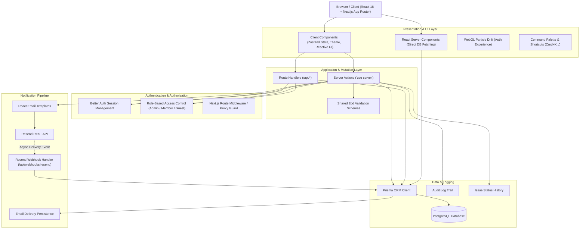
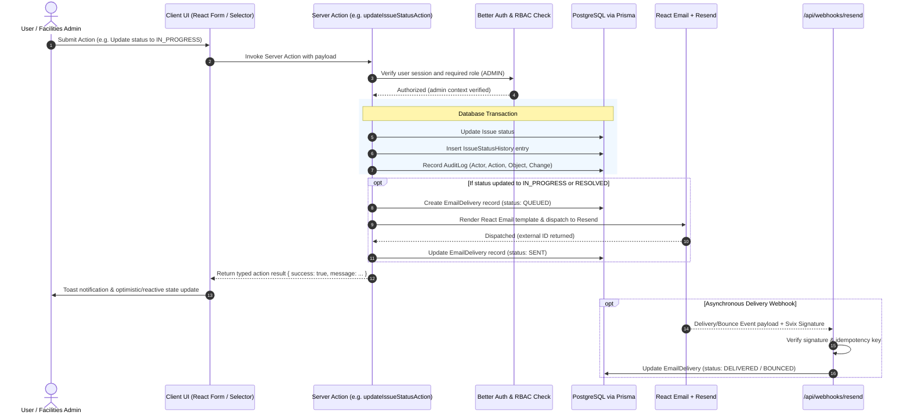

# CampusFix System Architecture

CampusFix is a production-grade university campus infrastructure issue reporting, facilities tracking, and incident triage platform.

---

## 1. High-Level Architectural Overview

CampusFix is built upon the Next.js 14 App Router full-stack paradigm, combining React Server Components (RSC), Client Components with granular state subscriptions via Zustand, authenticated Server Actions and Route Handlers, role-based access control (RBAC), Prisma ORM with PostgreSQL, and transactional email processing powered by Resend and React Email.

---

## 2. End-to-End Mutation & Event Flow

Every operational change in CampusFix (such as issue reporting, status triage, and technician assignment) follows an authoritative server-validated pipeline:

---

## 3. Core Subsystems

### 3.1 Authentication & Role-Based Authorization
- **Better Auth Integration**: Authoritative session management backed by PostgreSQL tables (`user`, `session`, `account`, `verification`).
- **Roles**:
  - `GUEST`: Read-only access to public directory; can inspect public issues.
  - `MEMBER`: Full reporting capabilities; ability to view personal reported issues (`viewScope: "mine"`).
  - `ADMIN`: Full facilities administration, triage, technician assignment, role promotion/demotion, audit trail inspection, and email delivery telemetry.
- **Server Guard**: `getServerSession()` verifies active session tokens server-side before any administrative action or page render executes.

### 3.2 Relational Data Models (Prisma & PostgreSQL)
- **User**: Authentication identity, assigned operational role (`ADMIN`, `MEMBER`, `GUEST`), timestamps.
- **Issue**: Campus infrastructure reports with `referenceCode` (e.g. `CFX-XXXX`), `title`, `description`, `category`, `priority` (`HIGH`, `MEDIUM`, `LOW`), `status` (`OPEN`, `IN_PROGRESS`, `RESOLVED`), `location`, reporter reference, and optional assignee reference.
- **IssueStatusHistory**: Complete append-only timeline of every status transition with timestamp, transition metadata, and actor note.
- **AuditLog**: Authoritative audit trail recording who performed what action, targeting which entity, with delta change tracking.
- **EmailDelivery**: Complete log of transactional email dispatches, tracking recipient, subject, event, external provider ID, and delivery state (`QUEUED`, `SENT`, `DELIVERED`, `BOUNCED`, `FAILED`).

### 3.3 Transactional Email & Webhook Processing
- **Email Dispatch**: Triggered on incident resolution or assignment updates using React Email templates (`IssueResolvedEmail`, `IssueAssignmentEmail`).
- **Resend Webhooks**: Endpoint `/api/webhooks/resend` validates cryptographic Svix webhook signatures, guarantees idempotent message processing, and updates database delivery states in real-time.
