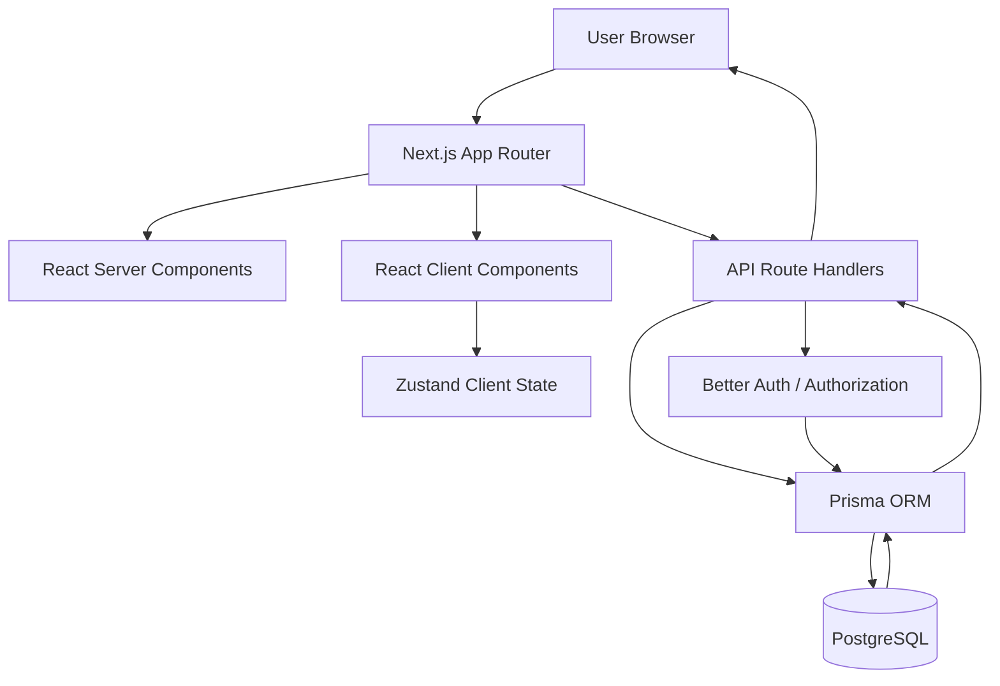
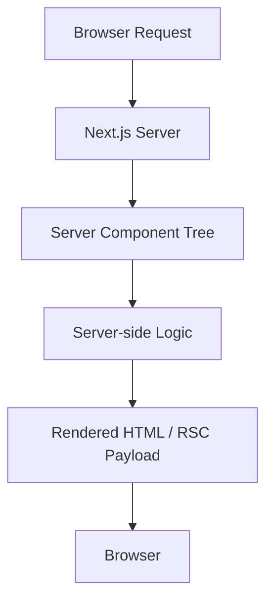
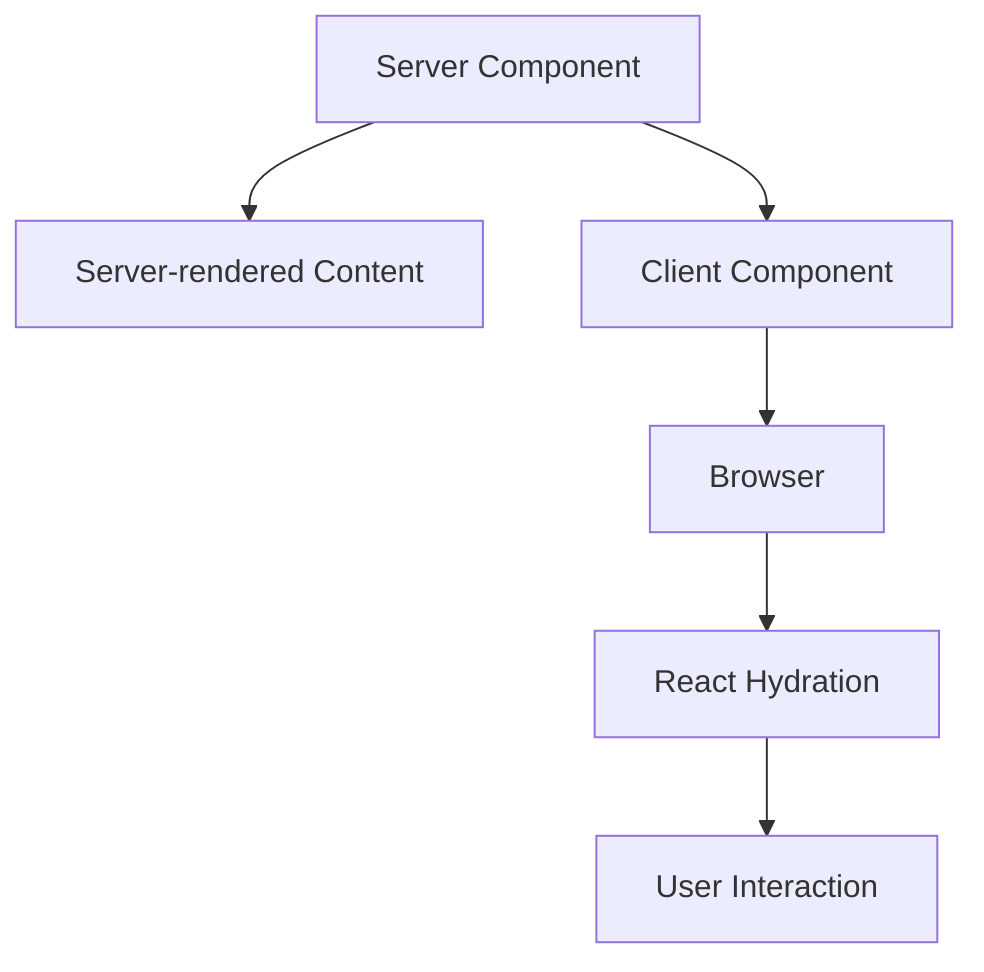
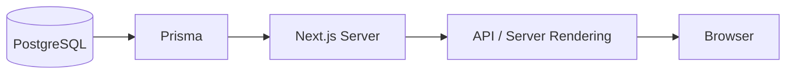
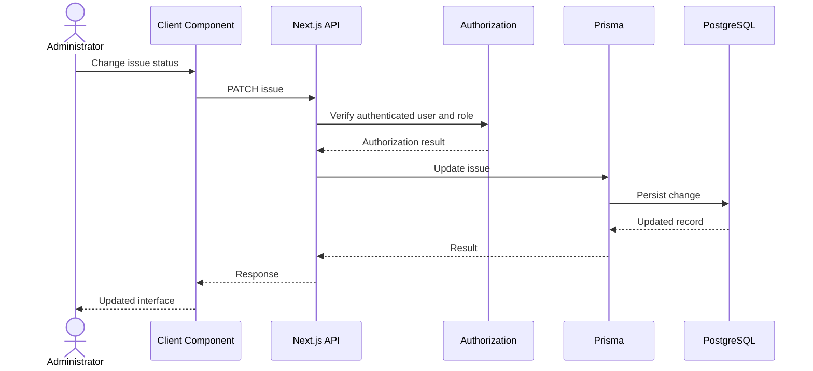
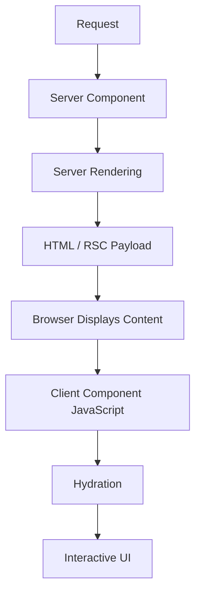
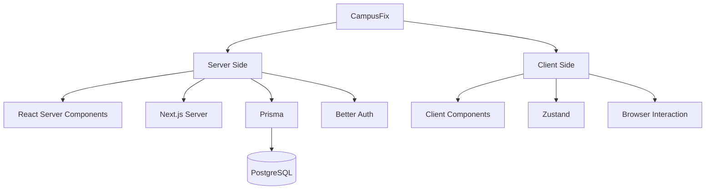

# CampusFix — Assignment 1 Technical Report

> **Course:** Full Stack Development  
> **Project:** CampusFix — Campus Issue Reporting & Resolution Platform  
> **Application:** Next.js 14 App Router + React 18 + TypeScript  
> **Deployment:** Netlify  
> **Report:** Assignment 1

---

## 1. Introduction

CampusFix is a full-stack campus issue reporting and resolution platform designed to convert campus problems into structured, trackable, and actionable service requests.

The application uses the Next.js App Router and React Server Components (RSC) architecture, while interactive functionality is implemented through Client Components and client-side state management. The application also uses Zustand for client state, Prisma for database access, Better Auth for authentication, PostgreSQL for persistent storage, and Netlify for deployment.

This report covers three areas of the CampusFix implementation:

1. **React Server Components vs. Client Components**, including render trees and hydration optimization strategies.
2. **Server state vs. Zustand client state**, including the separation between persistent application data and browser-side interaction state.
3. **Frontend performance**, evaluated using a Lighthouse audit of the deployed CampusFix application, with particular focus on Core Web Vitals and related loading metrics.

### Audit Target

```text
https://campusfixed.netlify.app/
```

The supplied Lighthouse report was generated using **Lighthouse 13.4.1** on **19 September 2026**. :contentReference[oaicite:0]{index=0}

---

# 2. Application Architecture

CampusFix follows a layered Next.js architecture in which rendering, interaction, authentication, API processing, and persistent data access are separated.

At a high level, the application can be represented as follows:



The architecture separates server-owned responsibilities from browser-side interaction.

### Server-side responsibilities

- Database access
- Persistent application data
- Authentication
- Authorization
- API processing
- Server-side rendering
- Role-based access decisions

### Client-side responsibilities

- User interaction
- Forms
- Dialogs and drawers
- Filters
- Theme interaction
- Command palette interaction
- Temporary UI state
- Browser-side event handling

This separation is important because CampusFix contains both server-owned information such as issues, users and permissions, and highly interactive UI elements such as forms, filters, drawers and administrative controls.

---

# 3. React Server Components vs. Client Components

## 3.1 React Server Components

CampusFix uses the Next.js App Router, where components are Server Components by default unless a component explicitly establishes a Client Component boundary.

A Server Component is rendered on the server and can participate in server-side application logic without requiring the entire component tree to be hydrated in the browser.

The basic rendering flow is:



For CampusFix, this architecture is useful because a significant portion of application information is server-owned.

Examples include:

- authenticated user information
- role information
- issue records
- administrative information
- database-derived content
- server-side authorization decisions

Keeping this type of work on the server reduces the amount of application logic that needs to be transferred to and executed by the browser.

---

## 3.2 Client Components

CampusFix uses Client Components when browser-side interaction is required.

A Client Component is explicitly marked using:

```tsx
"use client";
```

Client Components are appropriate when functionality requires browser-side React behavior such as:

- `useState`
- `useEffect`
- event handlers
- interactive forms
- dialogs and drawers
- client-side state
- keyboard interactions
- theme switching
- interactive filtering
- command palette interaction
- browser APIs

The conceptual flow is:



CampusFix therefore does not treat the entire application as one large Client Component. Client-side behavior is introduced where actual browser interaction requires it.

---

# 4. RSC and Client Component Render Tree

The main optimization benefit comes from keeping the server-rendered portion of the application separate from interactive client boundaries.

A simplified CampusFix render tree is:

```text
CampusFix Route
│
├── Server-rendered application shell
│
├── Server-rendered page content
│   │
│   ├── Database-derived information
│   ├── Authentication context
│   └── Role-aware content
│
└── Client Component boundaries
    │
    ├── Interactive forms
    ├── Dialogs / drawers
    ├── Filters
    ├── Zustand consumers
    ├── Command palette
    └── Theme / browser interactions
```

The key principle is:

> **Interactivity is localized instead of forcing the complete page into the client rendering model.**

This creates two clear responsibilities.

### Server rendering

```text
Server
│
├── Data access
├── Authentication
├── Authorization
├── Initial page structure
└── Server-side application logic
```

### Client rendering

```text
Browser
│
├── User interaction
├── Local UI state
├── Browser events
├── Forms
├── Dialogs
└── Client-side controls
```

This separation is particularly useful in CampusFix because most database information does not need to become independently managed browser state.

---

# 5. Hydration Optimization

Hydration is the process through which React attaches client-side behavior to server-rendered UI.

A well-structured application avoids unnecessarily hydrating static or server-owned content.

CampusFix follows several principles that support this approach.

---

## 5.1 Keep Server Components as the Default

The Next.js App Router uses Server Components by default.

Therefore, a component does not need to become client-side simply because it renders React markup.

Client boundaries are introduced when actual browser interaction is required.

This reduces unnecessary client-side JavaScript and hydration work.

---

## 5.2 Localize Client Boundaries

Instead of converting an entire page into a Client Component:

```tsx
"use client";
```

interactive functionality can remain inside smaller Client Components.

For example:

```text
Page
│
├── Server-rendered content
│
├── Issue information
│
└── Interactive issue controls
    │
    └── Client Component
```

This makes the hydration boundary more focused and avoids unnecessarily making unrelated content client-side.

---

## 5.3 Avoid Hydrating Database Data Unnecessarily

Database records are server-owned state.

For example, an issue retrieved from PostgreSQL does not need to become a large global Zustand object merely because the user can interact with that issue.

The conceptual flow is:

```text
PostgreSQL
    │
    ▼
Prisma
    │
    ▼
Next.js Server
    │
    ▼
Rendered Data
    │
    ▼
Small Interactive Client Boundary
```

Instead of:

```text
PostgreSQL
    │
    ▼
Server
    │
    ▼
Entire Application State
    │
    ▼
Large Client Store
    │
    ▼
Hydrate Everything
```

Keeping these responsibilities separate reduces unnecessary client-side state management.

---

## 5.4 Hydrate Interactive Behavior Only

The browser should receive the JavaScript necessary for interaction rather than treating all displayed content as interactive application state.

This is particularly relevant to:

- issue forms
- filters
- dialogs
- drawers
- command palette interactions
- theme controls
- administrative controls

---

# 6. Server State vs. Zustand Client State

CampusFix distinguishes between **server state** and **client/UI state**.

This prevents the client-side state layer from becoming a duplicate database.

---

## 6.1 Server State

Server state represents information whose authoritative source exists outside the browser.

For CampusFix, this includes:

- users
- roles
- issues
- issue status
- priorities
- assignments
- audit records
- persistent application data

The general lifecycle is:



The server remains the source of truth.

This is important for both consistency and security. A browser should not be treated as the authoritative source for role permissions or persistent database records.

---

# 7. Zustand Client State

Zustand is used for client-side state representing browser interaction and UI behavior.

Suitable examples include:

```text
Client / UI State
│
├── Dialog state
├── Drawer state
├── Temporary selections
├── Client-side interaction state
├── Filters / transient controls
└── Other browser-local state
```

The important architectural distinction is:

```text
SERVER STATE
│
├── Users
├── Issues
├── Roles
├── Database records
└── Persistent application data


CLIENT STATE
│
├── UI interactions
├── Temporary selections
├── Dialog state
├── Local controls
└── Browser interaction
```

Zustand therefore complements the server architecture rather than replacing PostgreSQL or Prisma.

---

# 8. Server State vs. Zustand — Comparison

| Aspect | Server State | Zustand Client State |
|---|---|---|
| Source of truth | Server / PostgreSQL | Browser |
| Persistence | Database-backed | Primarily in-memory client state |
| Primary purpose | Application data | UI / interaction state |
| Examples | Issues, users, roles | Dialogs, filters, selections |
| Access | Server/API | React Client Components |
| Authorization | Enforced server-side | Cannot replace server authorization |
| Lifecycle | Request/application dependent | Browser/session dependent |
| Database records | Appropriate | Only as a temporary representation when needed |
| UI state | Possible, but not its primary purpose | Appropriate |

The separation prevents the client-side state layer from becoming a second source of truth for persistent application data.

---

# 9. Why the Separation Matters in CampusFix

Consider an administrator changing an issue's status.

The operation can be represented as:



The database remains authoritative.

A client-side Zustand value can represent the current interface state, but it cannot be treated as proof that a user is authorized to perform an administrative operation.

This distinction is important for CampusFix's role-based access model.

---

# 10. Performance Analysis

## 10.1 Lighthouse Methodology

The deployed CampusFix application was audited using Lighthouse.

### Audit target

```text
https://campusfixed.netlify.app/
```

### Lighthouse version

```text
13.4.1
```

### Audit type

```text
Navigation
```

### Audit date

```text
19 September 2026
```

The supplied Lighthouse report recorded the deployed CampusFix URL as the final URL for the audit. :contentReference[oaicite:1]{index=1}

---

# 11. Lighthouse Results

The Lighthouse report produced the following category scores:

| Category | Score |
|---|---:|
| **Performance** | **88/100** |
| **Accessibility** | **91/100** |
| **Best Practices** | **100/100** |
| **SEO** | **100/100** |

The performance score for the captured audit was therefore **88/100**.

The supplied report also records HTTPS as successfully enabled for the deployed application.

---

# 12. Core Web Vitals and Loading Metrics

The relevant metrics from the supplied Lighthouse report are:

| Metric | Observed Value | Lighthouse Result |
|---|---:|---:|
| **Largest Contentful Paint (LCP)** | **1.2 s** | 0.89 audit score |
| **Cumulative Layout Shift (CLS)** | **0.002** | 1.00 audit score |
| **Interaction to Next Paint (INP)** | **Not measured** | Not available |
| **First Contentful Paint (FCP)** | **1.1 s** | 0.82 audit score |
| **Speed Index** | **2.9 s** | 0.30 audit score |
| **Total Blocking Time (TBT)** | **20 ms** | 1.00 audit score |

These values are taken from the supplied Lighthouse report. :contentReference[oaicite:2]{index=2}

---

# 13. Largest Contentful Paint — LCP

## Observed Result

```text
LCP = 1.2 seconds
```

LCP measures the time required for the largest visible content element in the initial viewport to become rendered.

The supplied report recorded an underlying value of approximately:

```text
1234 ms
```

with a displayed value of:

```text
1.2 s
```

For CampusFix, LCP is relevant because the initial interface needs to establish its visual hierarchy quickly.

The application uses Next.js rendering and a structured application shell so that the browser can begin displaying the page without requiring every interactive feature to become active first.

### Optimization considerations

Factors that can influence LCP include:

- server response time
- image loading
- font loading
- JavaScript execution
- CSS delivery
- client-side rendering work

The captured LCP baseline is:

```text
1.2 seconds
```

This value should be retained for comparison when future frontend changes are made.

---

# 14. Cumulative Layout Shift — CLS

## Observed Result

```text
CLS = 0.002
```

The underlying reported value was approximately:

```text
0.0017
```

with a displayed value of:

```text
0.002
```

CLS measures unexpected visual movement during page loading.

For CampusFix, layout stability is important because the application contains structured navigation, issue information, forms, tables, cards and interactive panels.

Unexpected movement could affect:

- navigation
- issue selection
- form interaction
- accessibility
- overall usability

### Layout stability practices

Layout stability can be supported by:

- reserving space for dynamic content
- providing predictable dimensions for media
- avoiding late insertion of major UI elements
- controlling font/layout changes
- keeping loading states structurally consistent

The measured baseline is:

```text
CLS = 0.002
```

---

# 15. Interaction to Next Paint — INP

The assignment requires analysis of **Interaction to Next Paint (INP)**.

However, the supplied Lighthouse report does **not** contain an `interaction-to-next-paint` audit.

Therefore:

```text
INP = Not measured in the supplied Lighthouse report
```

No INP value should be inferred from another metric.

The report does contain:

```text
Total Blocking Time = 20 ms
```

but:

```text
TBT ≠ INP
```

TBT and INP represent different measurements.

TBT measures main-thread blocking during the loading period, while INP evaluates responsiveness to user interactions.

Therefore, the correct conclusion for this particular audit is:

> **INP was not measured in the supplied Lighthouse navigation report.**

A separate interaction-focused performance measurement would be required to record an actual INP value.

---

# 16. First Contentful Paint — FCP

The Lighthouse report recorded:

```text
FCP = 1.1 seconds
```

FCP represents the time at which the first visible text or image is rendered.

The observed FCP of approximately 1.1 seconds indicates that visible content begins appearing early during the audited page load.

FCP and LCP measure different stages:

```text
FCP
│
└── First visible content
```

versus:

```text
LCP
│
└── Largest meaningful visible content
```

For CampusFix, FCP provides an indication of how quickly the browser begins presenting the application to the user.

---

# 17. Speed Index

The Lighthouse report recorded:

```text
Speed Index = 2.9 seconds
```

Speed Index represents how quickly visible content is populated during loading.

Unlike LCP, which focuses on the largest visible element, Speed Index considers the progression of visual completion.

The measured result indicates that there is room to investigate how quickly the entire initial viewport becomes visually complete.

Potential areas for further investigation include:

- JavaScript execution
- visual asset loading
- CSS processing
- font behavior
- Client Component initialization
- unnecessary browser-side work

---

# 18. Total Blocking Time

The Lighthouse report recorded:

```text
TBT = 20 ms
```

Total Blocking Time measures the amount of time during which the browser's main thread is blocked by long tasks during the loading period.

The low measured TBT is relevant to CampusFix's server/client architecture because the application does not require the entire application to become one large client-side React tree.

By keeping server-rendered content on the server and limiting Client Components to interactive areas, the application can reduce unnecessary browser-side JavaScript execution.

However:

```text
TBT should not be interpreted as an INP measurement.
```

---

# 19. Hydration and Performance Relationship

The RSC architecture and frontend performance are closely related.

A simplified rendering sequence is:



If the complete page were converted into a Client Component, more application code could become part of browser-side execution and hydration.

By keeping the server/client boundary deliberate, CampusFix can limit the amount of JavaScript that needs to participate in client-side rendering.

This is particularly useful for pages containing substantial database-derived content.

---

# 20. Performance Optimization Strategies

## 20.1 Server-first Rendering

Using Server Components where interaction is unnecessary reduces the need to hydrate static or server-owned content.

---

## 20.2 Narrow Client Component Boundaries

Client Components should be restricted to functionality that actually requires browser-side React behavior.

This reduces the scope of hydration and helps prevent unnecessary client-side JavaScript.

---

## 20.3 Avoid Unnecessary Global Client State

Database records should remain server-owned rather than being duplicated into Zustand unnecessarily.

This reduces:

- client memory usage
- synchronization complexity
- unnecessary state updates
- duplicated application state

---

## 20.4 Keep Authorization on the Server

Authorization decisions should be performed on the server/API layer rather than relying on client-side state.

Client state can control the interface, but it must not be treated as a security boundary.

---

## 20.5 Monitor Visual Loading

The Lighthouse audit establishes the following measured baseline:

```text
FCP  = 1.1 s
LCP  = 1.2 s
CLS  = 0.002
TBT  = 20 ms
```

These values provide a concrete reference point for future performance comparisons.

---

# 21. Performance Baseline

The captured Lighthouse run establishes the following baseline for the deployed CampusFix application:

```text
┌────────────────────────────────────────┐
│        CAMPUSFIX LIGHTHOUSE BASELINE   │
├────────────────────────────────────────┤
│ Performance       88 / 100             │
│ Accessibility     91 / 100             │
│ Best Practices   100 / 100             │
│ SEO              100 / 100             │
├────────────────────────────────────────┤
│ FCP                 1.1 s              │
│ LCP                 1.2 s              │
│ CLS                 0.002              │
│ TBT                  20 ms             │
│ Speed Index          2.9 s             │
│ INP              Not measured          │
└────────────────────────────────────────┘
```

The corresponding Lighthouse category results and metric values are documented in the supplied audit. :contentReference[oaicite:3]{index=3}

This baseline should be retained when evaluating future changes to the CampusFix frontend.

---

# 22. Overall Technical Analysis

CampusFix uses a server-first rendering model with explicit client-side interaction boundaries.

The architecture can be summarized as:



The separation provides several architectural benefits:

- Server-owned data remains authoritative.
- Database access remains on the server.
- Authorization is not delegated to client state.
- Interactive behavior is isolated to Client Components.
- Zustand handles suitable client-side state instead of replacing the database.
- Server rendering reduces the need to hydrate every part of the application.
- The architecture provides a clear foundation for frontend performance optimization.

The Lighthouse audit provides a measured performance baseline for the deployed application.

---

# 23. Conclusion

CampusFix demonstrates a practical implementation of modern Next.js rendering and state-management architecture.

The use of React Server Components allows server-owned content and data-dependent rendering to remain on the server, while Client Components are introduced where browser-side interaction is required.

The distinction between server state and Zustand client state prevents the client state layer from becoming a duplicate source of truth for persistent application data. PostgreSQL and the server-side application remain authoritative, while Zustand handles appropriate browser-side interaction state.

The Lighthouse audit of the deployed application produced the following results:

| Metric | Result |
|---|---:|
| Performance | **88/100** |
| Accessibility | **91/100** |
| Best Practices | **100/100** |
| SEO | **100/100** |
| LCP | **1.2 s** |
| CLS | **0.002** |
| FCP | **1.1 s** |
| TBT | **20 ms** |
| Speed Index | **2.9 s** |
| INP | **Not measured** |

INP is explicitly marked as unavailable because the supplied Lighthouse report did not contain an INP audit.

Overall, the architecture demonstrates a deliberate separation between:

```text
Server Rendering
        │
        ├── Persistent Data
        ├── Authentication
        ├── Authorization
        └── Database Access

Client Interaction
        │
        ├── UI State
        ├── Forms
        ├── Dialogs
        ├── Filters
        └── Browser Interaction
```

This separation provides a clear architectural foundation for maintaining the application while keeping server-owned data, client interaction and frontend performance concerns distinct.

---

# 24. Evidence and Supporting Material

The following evidence should accompany this report in the repository or submission package.

---

## Figure A1-01 — CampusFix Application

**Purpose:** Demonstrates the deployed CampusFix application interface.

**Source:**

```text
https://campusfixed.netlify.app/
```

**Suggested screenshot:** Capture the main deployed application interface after successful authentication.

---

## Figure A1-02 — Server Component Implementation

**Purpose:** Demonstrates the use of a Next.js Server Component.

**Evidence to include:**

A screenshot of the relevant CampusFix source file showing a component that does not require the `"use client"` directive and participates in the server-rendered application tree.

**Caption:**

> **Figure A1-02:** Server Component implementation used by the CampusFix application, demonstrating the server-first rendering approach.

---

## Figure A1-03 — Client Component Boundary

**Purpose:** Demonstrates where browser-side interactivity is introduced.

**Evidence to include:**

A screenshot of a relevant CampusFix Client Component showing:

```tsx
"use client";
```

and the corresponding interactive logic.

**Caption:**

> **Figure A1-03:** Client Component boundary used for browser-side interaction in CampusFix.

---

## Figure A1-04 — Zustand Client State

**Purpose:** Demonstrates the use of Zustand for client-side interaction state.

**Evidence to include:**

A screenshot of the relevant Zustand store and/or the component consuming the store.

**Caption:**

> **Figure A1-04:** Zustand implementation used to manage browser-side UI/client state.

---

## Figure A1-05 — Lighthouse Performance Report

**Purpose:** Demonstrates the measured performance of the deployed CampusFix application.

**Audit target:**

```text
https://campusfixed.netlify.app/
```

**Observed metrics:**

```text
Performance: 88
LCP: 1.2 s
CLS: 0.002
FCP: 1.1 s
TBT: 20 ms
Speed Index: 2.9 s
INP: Not measured
```

**Caption:**

> **Figure A1-05:** Lighthouse performance audit of the deployed CampusFix application.

---

## Figure A1-06 — Lighthouse Category Results

**Purpose:** Demonstrates the overall Lighthouse category results.

```text
Performance       88
Accessibility     91
Best Practices   100
SEO              100
```

**Caption:**

> **Figure A1-06:** Lighthouse category scores for the deployed CampusFix application.

---

# 25. Suggested Evidence Placement

For the final repository, the report can be organized as:

```text
CampusFix/
│
├── app/
├── components/
├── lib/
├── prisma/
├── public/
├── docs/
│   │
│   ├── assignment-1.md
│   ├── assignment-2.md
│   └── architecture.md
│
├── README.md
├── package.json
└── ...
```

The Assignment 1 report should reference screenshots that demonstrate the actual implementation rather than generic diagrams alone.

A suitable evidence set is:

```text
A1-01  Deployed CampusFix UI
A1-02  Server Component source
A1-03  Client Component source
A1-04  Zustand store
A1-05  Lighthouse performance metrics
A1-06  Lighthouse category scores
```

---

# 26. References

1. CampusFix source repository.
2. Next.js App Router and React Server Components implementation used by CampusFix.
3. Zustand client-side state management implementation used by CampusFix.
4. Lighthouse audit generated for:

```text
https://campusfixed.netlify.app/
```

**Lighthouse version:** `13.4.1`  
**Audit date:** `19 September 2026`

---

> **Performance note:** All Lighthouse values in this report are based on the supplied Lighthouse navigation report for the deployed CampusFix application. The report records Performance **88**, Accessibility **91**, Best Practices **100**, SEO **100**, LCP **1.2 s**, CLS **0.002**, FCP **1.1 s**, Speed Index **2.9 s**, and TBT **20 ms**. INP was not measured in the supplied report. :contentReference[oaicite:4]{index=4}