# CampusFix — Assignment 2 Technical Report

> **Course:** Full Stack Development  
> **Project:** CampusFix — Campus Issue Reporting & Resolution Platform  
> **Application:** Next.js 14 App Router + React 18 + TypeScript  
> **Database:** PostgreSQL  
> **ORM:** Prisma  
> **Authentication:** Better Auth  
> **Email:** React Email + Resend  
> **Deployment:** Netlify  
> **Report:** Assignment 2

---

## 1. Introduction

CampusFix is a full-stack campus issue reporting and resolution platform designed to provide a structured workflow for reporting, tracking, assigning, and resolving campus issues.

The application uses PostgreSQL as its persistent database, Prisma as the ORM and database access layer, Better Auth for authentication and session management, Next.js API Route Handlers for server-side application operations, and React Email with Resend for transactional email delivery.

This report documents the database architecture, data relationships, migration and seed workflow, authorization flow, API processing, audit logging, and email delivery architecture used by CampusFix.

The overall system can be represented as:

```text
┌──────────────────────────────────────────────────────────────┐
│                         CAMPUSFIX                             │
├──────────────────────────────────────────────────────────────┤
│                                                              │
│  Next.js Application                                         │
│       │                                                      │
│       ├── Authentication / Authorization                     │
│       │                                                      │
│       ├── API Route Handlers                                 │
│       │                                                      │
│       ├── React / Client Interface                           │
│       │                                                      │
│       └── Email / Webhook Processing                         │
│                                                              │
│                         │                                    │
│                         ▼                                    │
│                      Prisma                                  │
│                         │                                    │
│                         ▼                                    │
│                   PostgreSQL                                 │
│                                                              │
└──────────────────────────────────────────────────────────────┘
```

---

# 2. System Architecture

CampusFix follows a layered architecture in which the presentation layer, authentication layer, API layer, data-access layer, database, and email infrastructure have clearly separated responsibilities.

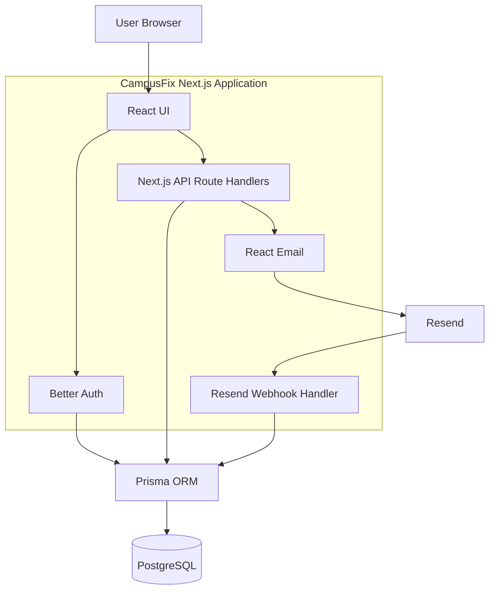
```mermaid
flowchart TB
    USER["User Browser"]

    subgraph APP["CampusFix Next.js Application"]
        UI["React UI"]
        AUTH["Better Auth"]
        API["Next.js API Route Handlers"]
        EMAIL["React Email"]
        WEBHOOK["Resend Webhook Handler"]
    end

    PRISMA["Prisma ORM"]
    DB[("PostgreSQL")]
    RESEND["Resend"]

    USER --> UI
    UI --> AUTH
    UI --> API

    AUTH --> PRISMA
    API --> PRISMA
    PRISMA --> DB

    API --> EMAIL
    EMAIL --> RESEND

    RESEND --> WEBHOOK
    WEBHOOK --> PRISMA
```

### Main Responsibilities

| Layer | Responsibility |
|---|---|
| React UI | User interaction and presentation |
| Next.js App Router | Routing and server-side rendering |
| Better Auth | Authentication and session management |
| API Route Handlers | Server-side application operations |
| Prisma | Database access and transactions |
| PostgreSQL | Persistent application data |
| React Email | Transactional email templates |
| Resend | Email delivery |
| Webhook Handler | Delivery-event verification and persistence |

The database remains the persistent source of truth for application records.

---

# 3. Database Architecture

CampusFix uses PostgreSQL with Prisma as the database access layer.

The database is responsible for persistent application records including:

- users
- authentication accounts
- sessions
- issues
- issue status
- issue assignments
- issue history
- audit records
- email activity
- other relational application data

The application-to-database relationship is:

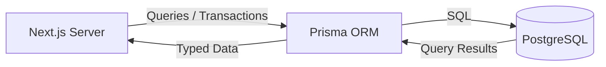
```mermaid
flowchart LR
    SERVER["Next.js Server"]
    PRISMA["Prisma ORM"]
    DB[("PostgreSQL")]

    SERVER -->|"Queries / Transactions"| PRISMA
    PRISMA -->|"SQL"| DB
    DB -->|"Query Results"| PRISMA
    PRISMA -->|"Typed Data"| SERVER
```

Prisma provides the application with a typed interface for database operations while PostgreSQL provides persistent storage.

---

# 4. Prisma Schema

The Prisma schema is the central definition of the application's relational database structure.

The relevant project structure is:

```text
prisma/
├── schema.prisma
├── seed.ts
└── migrations/
    └── 20260912141001_init/
```

The schema uses PostgreSQL as its database provider:

```prisma
datasource db {
  provider = "postgresql"
}
```

The database connection string is supplied through environment configuration rather than being hard-coded into the schema.

This keeps database credentials outside the source code.

---

# 5. Data Relationship Model

CampusFix follows a relational database model in which records are connected using primary keys and foreign keys.

The following diagram represents the main logical relationships documented for the application:

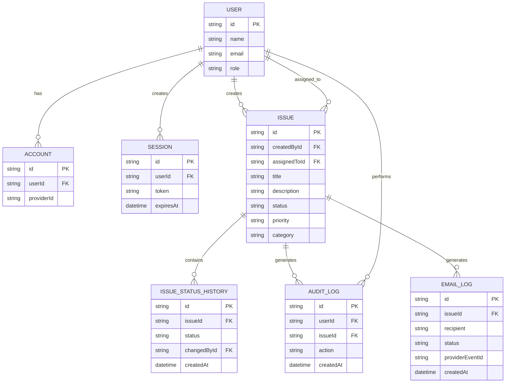
```mermaid
erDiagram
    USER ||--o{ ACCOUNT : has
    USER ||--o{ SESSION : creates

    USER ||--o{ ISSUE : creates
    USER ||--o{ ISSUE : assigned_to

    ISSUE ||--o{ ISSUE_STATUS_HISTORY : contains
    ISSUE ||--o{ AUDIT_LOG : generates
    ISSUE ||--o{ EMAIL_LOG : generates

    USER ||--o{ AUDIT_LOG : performs

    USER {
        string id PK
        string name
        string email
        string role
    }

    ACCOUNT {
        string id PK
        string userId FK
        string providerId
    }

    SESSION {
        string id PK
        string userId FK
        string token
        datetime expiresAt
    }

    ISSUE {
        string id PK
        string createdById FK
        string assignedToId FK
        string title
        string description
        string status
        string priority
        string category
    }

    ISSUE_STATUS_HISTORY {
        string id PK
        string issueId FK
        string status
        string changedById FK
        datetime createdAt
    }

    AUDIT_LOG {
        string id PK
        string userId FK
        string issueId FK
        string action
        datetime createdAt
    }

    EMAIL_LOG {
        string id PK
        string issueId FK
        string recipient
        string status
        string providerEventId
        datetime createdAt
    }
```

> **Schema note:** The diagram represents the logical relationships documented for CampusFix. The repository's current `prisma/schema.prisma` remains the authoritative source for the exact model names, fields, constraints, and additional authentication/supporting models.

---

# 6. Core Database Relationships

The central relationship in the issue-management domain is between users and issues.

```text
USER
 │
 ├── creates ───────────────► ISSUE
 │
 ├── assigned to ───────────► ISSUE
 │
 └── performs ──────────────► AUDIT LOG
```

An issue can then have associated operational records:

```text
ISSUE
 │
 ├── STATUS HISTORY
 │
 ├── AUDIT LOGS
 │
 └── EMAIL ACTIVITY
```

This structure allows CampusFix to preserve the current state of an issue while also maintaining historical information about important changes and system activity.

---

# 7. Issue Lifecycle

An issue follows a structured lifecycle within the application.

A simplified representation is:

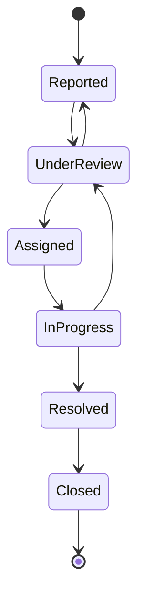
```mermaid
stateDiagram-v2
    [*] --> Reported

    Reported --> UnderReview
    UnderReview --> Assigned
    Assigned --> InProgress
    InProgress --> Resolved
    Resolved --> Closed

    UnderReview --> Reported
    InProgress --> UnderReview

    Closed --> [*]
```

The exact status values are defined by the application's schema and business logic.

The important architectural principle is that status changes are persisted on the server rather than being treated as browser-only state.

---

# 8. Database Migration Architecture

Prisma migrations are used to version the database schema.

The project contains the initial migration:

```text
prisma/migrations/
└── 20260912141001_init/
```

The migration workflow is:

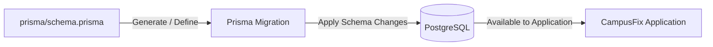
```mermaid
flowchart LR
    A["prisma/schema.prisma"]
    B["Prisma Migration"]
    C[("PostgreSQL")]
    D["CampusFix Application"]

    A -->|"Generate / Define"| B
    B -->|"Apply Schema Changes"| C
    C -->|"Available to Application"| D
```

A migration records the structural changes required to bring a database to the expected schema.

This makes the database structure reproducible across environments.

---

# 9. Migration Execution

The migration was successfully deployed against the PostgreSQL database.

The migration command used was:

```bash
npx prisma migrate deploy
```

The successful execution established the application schema in PostgreSQL.

The migration execution confirmed:

```text
1 migration found

20260912141001_init

Migration successfully applied
```

The complete flow is:

```text
Local Project
     │
     ▼
prisma/schema.prisma
     │
     ▼
Prisma Migration
     │
     ▼
PostgreSQL
     │
     ▼
CampusFix Application
```

---

# 10. Database Seeding

CampusFix includes a Prisma seed script:

```text
prisma/seed.ts
```

The seed process was executed using:

```bash
npx prisma db seed
```

The seed operation successfully populated the initial application dataset.

The execution produced the following results:

```text
Starting CampusFix database seeding...

Cleared existing database tables.

Created 6 seed users with Better Auth credential accounts.

Seeded 12 relational campus issues with audit logs,
status histories, and email delivery receipts.
```

The seed process demonstrates that the database can be populated with a consistent relational dataset rather than isolated records.

---

# 11. Seed Data Structure

The seeded environment contains users representing the application's role model.

The documented demonstration roles include:

```text
ADMIN
MEMBER
GUEST
```

The seed also creates relational issue data and associated operational records.

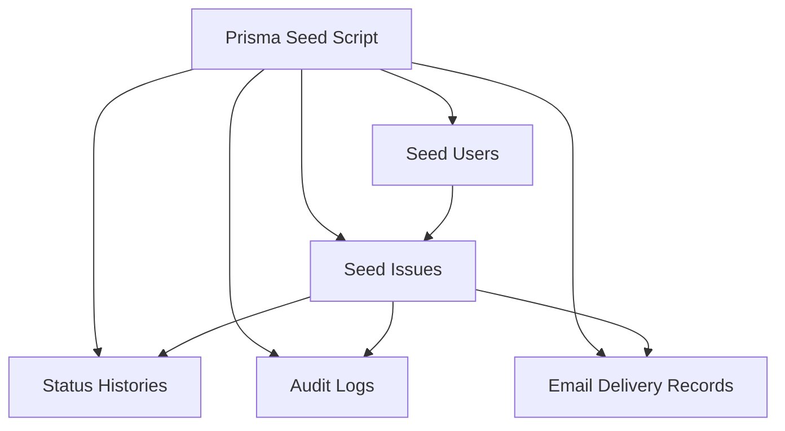
```mermaid
flowchart TD
    SEED["Prisma Seed Script"]

    USERS["Seed Users"]
    ISSUES["Seed Issues"]
    HISTORY["Status Histories"]
    AUDIT["Audit Logs"]
    EMAIL["Email Delivery Records"]

    SEED --> USERS
    SEED --> ISSUES
    SEED --> HISTORY
    SEED --> AUDIT
    SEED --> EMAIL

    USERS --> ISSUES
    ISSUES --> HISTORY
    ISSUES --> AUDIT
    ISSUES --> EMAIL
```

This allows the application to demonstrate relationships between users, issues, status history, audit records, and email activity.

---

# 12. Seed Data and Authentication

The seed process creates Better Auth credential accounts for the seeded users.

The authentication relationship can be represented as:

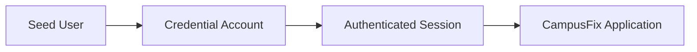
```mermaid
flowchart LR
    USER["Seed User"]
    ACCOUNT["Credential Account"]
    SESSION["Authenticated Session"]
    APP["CampusFix Application"]

    USER --> ACCOUNT
    ACCOUNT --> SESSION
    SESSION --> APP
```

The seed environment can therefore be used to verify:

- authentication
- role-based access
- issue visibility
- administrative operations
- authorization boundaries

> **Security note:** Demonstration passwords and authentication secrets must not be exposed in production documentation or public repositories. Any screenshot containing credentials should have passwords and sensitive values redacted before being committed.

---

# 13. Authentication and Authorization Flow

CampusFix separates authentication from authorization.

### Authentication

Authentication answers:

> **Who is the user?**

### Authorization

Authorization answers:

> **What is the authenticated user allowed to do?**

The overall flow is:

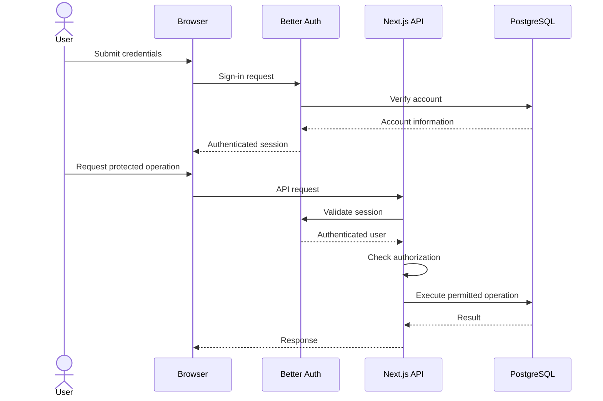
```mermaid
sequenceDiagram
    actor User
    participant Browser
    participant Auth as Better Auth
    participant API as Next.js API
    participant DB as PostgreSQL

    User->>Browser: Submit credentials
    Browser->>Auth: Sign-in request
    Auth->>DB: Verify account
    DB-->>Auth: Account information
    Auth-->>Browser: Authenticated session

    User->>Browser: Request protected operation
    Browser->>API: API request
    API->>Auth: Validate session
    Auth-->>API: Authenticated user
    API->>API: Check authorization
    API->>DB: Execute permitted operation
    DB-->>API: Result
    API-->>Browser: Response
```

The browser session establishes the user's authenticated identity.

The server remains responsible for determining whether a requested operation is permitted.

---

# 14. Role-Based Authorization

CampusFix uses role-aware access control.

The documented roles are:

| Role | General Responsibility |
|---|---|
| **ADMIN** | Administrative operations and management |
| **MEMBER** | Normal authenticated application usage |
| **GUEST** | Restricted access |

The authorization process is:

```text
Request
   │
   ▼
Authenticated?
   │
   ├── No ─────────► Reject
   │
   ▼
Identify User
   │
   ▼
Check Role
   │
   ├── Not Authorized ──► Reject
   │
   ▼
Perform Operation
```

Client-side UI restrictions improve the user experience, but they are not a substitute for server-side authorization.

---

# 15. API Architecture

CampusFix uses Next.js API Route Handlers for server-side application operations.

Important API areas include:

```text
/api/issues
/api/issues/[id]
/api/admin/audit
/api/auth/[...all]
/api/webhooks/resend
```

The API architecture keeps database operations and authorization checks on the server.

A protected API operation follows this general flow:

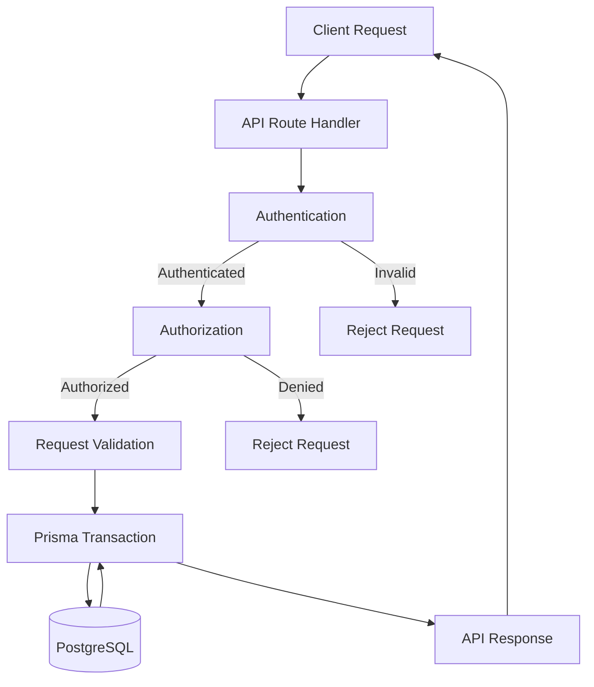
```mermaid
flowchart TD
    REQUEST["Client Request"]
    API["API Route Handler"]
    AUTH["Authentication"]
    RBAC["Authorization"]
    VALIDATE["Request Validation"]
    PRISMA["Prisma Transaction"]
    DB[("PostgreSQL")]
    RESPONSE["API Response"]

    REQUEST --> API
    API --> AUTH

    AUTH -->|"Authenticated"| RBAC
    AUTH -->|"Invalid"| REJECT1["Reject Request"]

    RBAC -->|"Authorized"| VALIDATE
    RBAC -->|"Denied"| REJECT2["Reject Request"]

    VALIDATE --> PRISMA
    PRISMA --> DB
    DB --> PRISMA
    PRISMA --> RESPONSE
    RESPONSE --> REQUEST
```

This ensures that persistent operations are performed through the server rather than directly from the browser.

---

# 16. Issue API Processing

The issue detail API supports retrieving an issue and performing administrative updates.

The API behavior can be represented as:

```text
Client
  │
  ▼
/api/issues/[id]
  │
  ├── GET
  │    │
  │    ├── Authenticate
  │    ├── Retrieve issue
  │    ├── Retrieve related user data
  │    └── Retrieve status history
  │
  └── PATCH
       │
       ├── Authenticate
       ├── Verify ADMIN authorization
       ├── Validate update
       ├── Update issue
       ├── Record status history
       ├── Record audit information
       └── Return updated result
```

The update operation is performed using a Prisma transaction.

This allows the issue update and its associated history/audit records to be handled as one database operation.

---

# 17. Transactional Issue Update

The issue update process can be represented as:

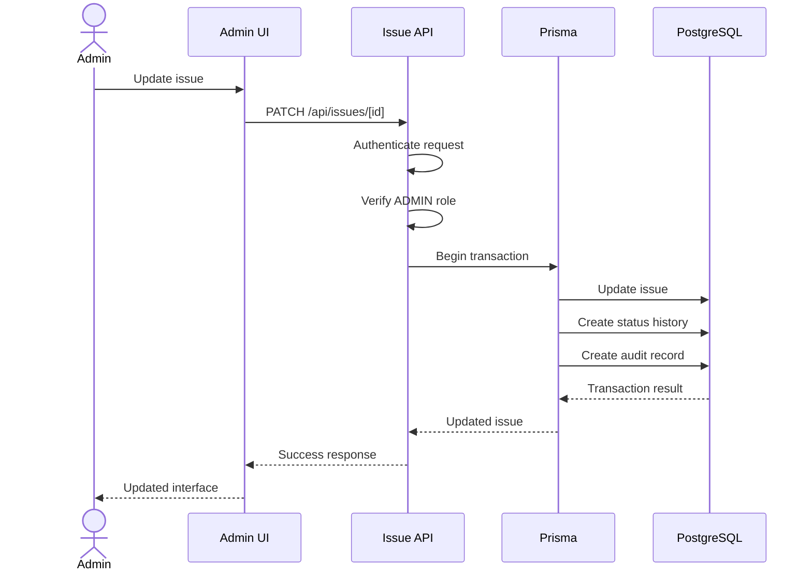
```mermaid
sequenceDiagram
    actor Admin
    participant UI as Admin UI
    participant API as Issue API
    participant Prisma
    participant DB as PostgreSQL

    Admin->>UI: Update issue
    UI->>API: PATCH /api/issues/[id]

    API->>API: Authenticate request
    API->>API: Verify ADMIN role

    API->>Prisma: Begin transaction

    Prisma->>DB: Update issue
    Prisma->>DB: Create status history
    Prisma->>DB: Create audit record

    DB-->>Prisma: Transaction result
    Prisma-->>API: Updated issue

    API-->>UI: Success response
    UI-->>Admin: Updated interface
```

Using a transaction is important because the issue update and related history/audit records are logically connected.

---

# 18. Audit Trail

CampusFix maintains an audit trail for important application operations.

The audit trail provides a record of:

```text
Who
 │
 └── performed the action

What
 │
 └── operation was performed

When
 │
 └── operation occurred
```

The relationship can be represented as:

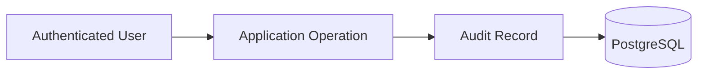
```mermaid
flowchart LR
    USER["Authenticated User"]
    ACTION["Application Operation"]
    AUDIT["Audit Record"]
    DB[("PostgreSQL")]

    USER --> ACTION
    ACTION --> AUDIT
    AUDIT --> DB
```

This allows administrative activity to remain traceable after the original request has completed.

---

# 19. Status History

Issue status changes are represented historically rather than only storing the latest status.

For example:

```text
Issue
│
├── REPORTED
│
├── UNDER_REVIEW
│
├── ASSIGNED
│
├── IN_PROGRESS
│
└── RESOLVED
```

This allows the application to preserve the progression of an issue.

The relationship is:

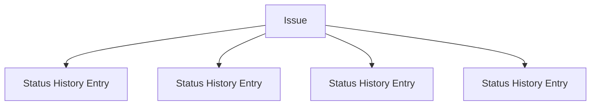
```mermaid
flowchart TD
    ISSUE["Issue"]

    H1["Status History Entry"]
    H2["Status History Entry"]
    H3["Status History Entry"]
    H4["Status History Entry"]

    ISSUE --> H1
    ISSUE --> H2
    ISSUE --> H3
    ISSUE --> H4
```

---

# 20. Email Architecture

CampusFix uses React Email for email template generation and Resend for delivery.

The email architecture is:

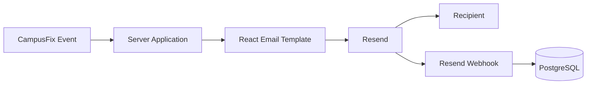
```mermaid
flowchart LR
    EVENT["CampusFix Event"]
    APP["Server Application"]
    TEMPLATE["React Email Template"]
    RESEND["Resend"]
    USER["Recipient"]
    WEBHOOK["Resend Webhook"]
    DB[("PostgreSQL")]

    EVENT --> APP
    APP --> TEMPLATE
    TEMPLATE --> RESEND
    RESEND --> USER

    RESEND --> WEBHOOK
    WEBHOOK --> DB
```

This separates email generation from external email delivery.

---

# 21. React Email

React Email is used to create structured email templates using React-based components.

The conceptual process is:

```text
CampusFix Event
      │
      ▼
Email Template
      │
      ▼
React Email
      │
      ▼
Rendered Email
      │
      ▼
Resend
```

Using a component-based email template system keeps email presentation close to the application code and makes templates easier to maintain.

The repository contains the actual React Email implementation used by the application.

---

# 22. Resend Delivery

Resend acts as the external email delivery provider.

The delivery flow is:

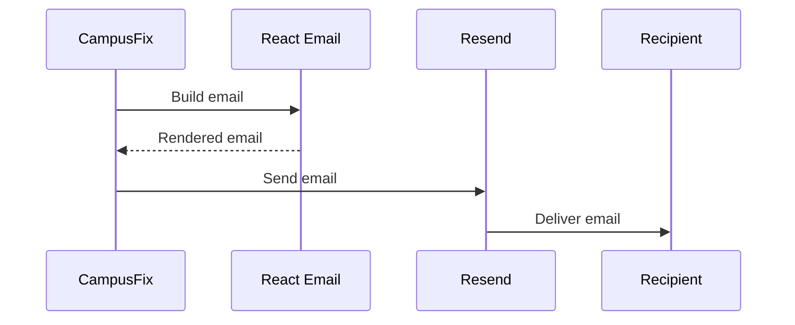
```mermaid
sequenceDiagram
    participant APP as CampusFix
    participant EMAIL as React Email
    participant RESEND as Resend
    participant USER as Recipient

    APP->>EMAIL: Build email
    EMAIL-->>APP: Rendered email
    APP->>RESEND: Send email
    RESEND->>USER: Deliver email
```

The application therefore delegates the underlying email delivery process to Resend.

---

# 23. Resend Webhook Processing

CampusFix includes the Resend webhook endpoint:

```text
/api/webhooks/resend
```

The webhook processes delivery events received from Resend.

The flow is:

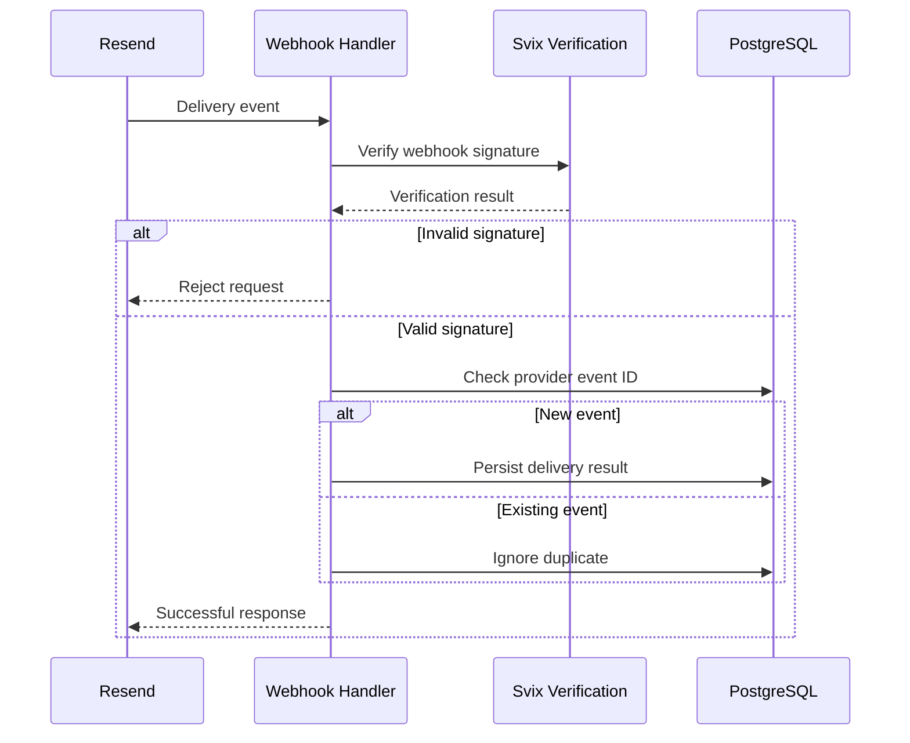
```mermaid
sequenceDiagram
    participant RESEND as Resend
    participant WEBHOOK as Webhook Handler
    participant VERIFY as Svix Verification
    participant DB as PostgreSQL

    RESEND->>WEBHOOK: Delivery event
    WEBHOOK->>VERIFY: Verify webhook signature
    VERIFY-->>WEBHOOK: Verification result

    alt Invalid signature
        WEBHOOK-->>RESEND: Reject request
    else Valid signature
        WEBHOOK->>DB: Check provider event ID

        alt New event
            WEBHOOK->>DB: Persist delivery result
        else Existing event
            WEBHOOK->>DB: Ignore duplicate
        end

        WEBHOOK-->>RESEND: Successful response
    end
```

The webhook uses signature verification and idempotency handling.

---

# 24. Webhook Security

Webhook requests should not be trusted simply because they originate from an external provider.

CampusFix uses Svix-based verification before processing incoming Resend events.

The security boundary is:

```text
Resend
   │
   ▼
Webhook Endpoint
   │
   ▼
Signature Verification
   │
   ├── Invalid ──► Reject
   │
   ▼
Valid Event
   │
   ▼
Idempotency Check
   │
   ▼
Persist Event
```

This ensures that an unverified request is not treated as a legitimate provider event.

---

# 25. Webhook Idempotency

Webhook providers can retry events.

Without idempotency, the same event could potentially be processed multiple times.

CampusFix uses the provider event identifier to prevent duplicate processing.

The conceptual logic is:

```text
Incoming Event
      │
      ▼
Read providerEventId
      │
      ▼
Does event already exist?
      │
      ├── YES ──► Ignore duplicate
      │
      └── NO
           │
           ▼
       Process Event
           │
           ▼
       Store Event ID
```

This allows repeated webhook deliveries to be handled safely.

---

# 26. Email Delivery Records

Email activity is persisted so that delivery information is not limited to the external email provider.

The relationship is:

```text
CampusFix Event
      │
      ▼
Email Sent
      │
      ▼
Resend
      │
      ▼
Webhook Event
      │
      ▼
Email Delivery Record
      │
      ▼
PostgreSQL
```

This provides the application with a local record of email-related activity.

---

# 27. End-to-End Issue Workflow

The complete operational workflow can be summarized as:

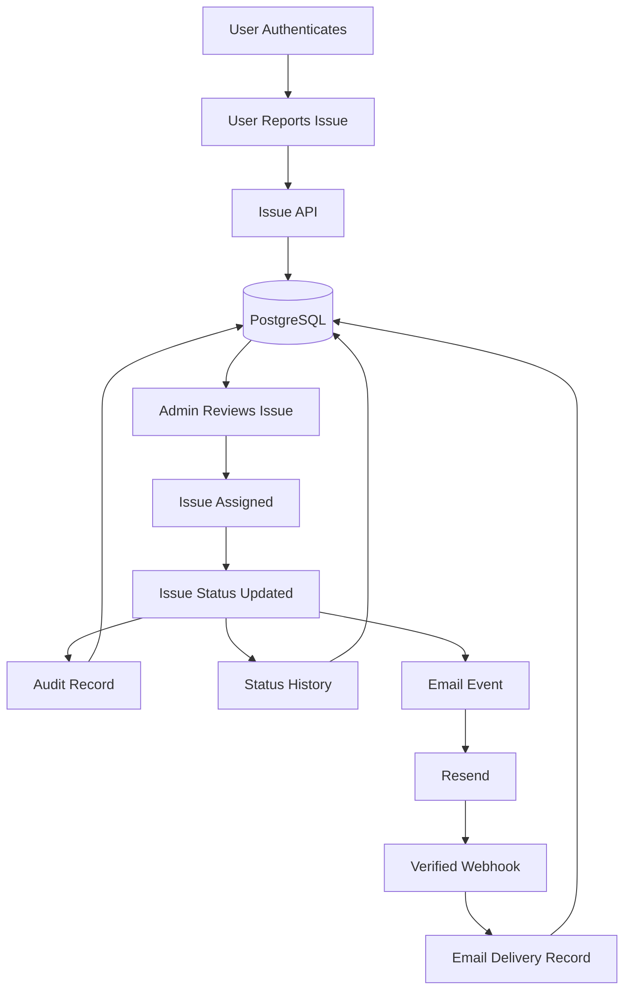
```mermaid
flowchart TD
    A["User Authenticates"]
    B["User Reports Issue"]
    C["Issue API"]
    D[("PostgreSQL")]
    E["Admin Reviews Issue"]
    F["Issue Assigned"]
    G["Issue Status Updated"]
    H["Audit Record"]
    I["Status History"]
    J["Email Event"]
    K["Resend"]
    L["Verified Webhook"]
    M["Email Delivery Record"]

    A --> B
    B --> C
    C --> D

    D --> E
    E --> F
    F --> G

    G --> H
    G --> I
    G --> J

    J --> K
    K --> L
    L --> M

    H --> D
    I --> D
    M --> D
```

This demonstrates how an operational action can result in multiple related persistent records while remaining within the server-side architecture.

---

# 28. Database Consistency

The relational architecture helps maintain consistency between related records.

For example, when an administrator changes an issue's status, the operation can update:

```text
Issue
   +
Status History
   +
Audit Record
```

within a single transaction.

The conceptual transaction is:

```text
BEGIN TRANSACTION
       │
       ├── Update Issue
       │
       ├── Create Status History
       │
       └── Create Audit Record
       │
       ▼
COMMIT
```

If the transaction cannot complete successfully:

```text
ROLLBACK
```

This prevents the application from leaving the database in a partially updated state.

---

# 29. Deployment Architecture

The deployed CampusFix system uses Netlify for application hosting and Neon PostgreSQL for the deployed database environment.

The production architecture is:

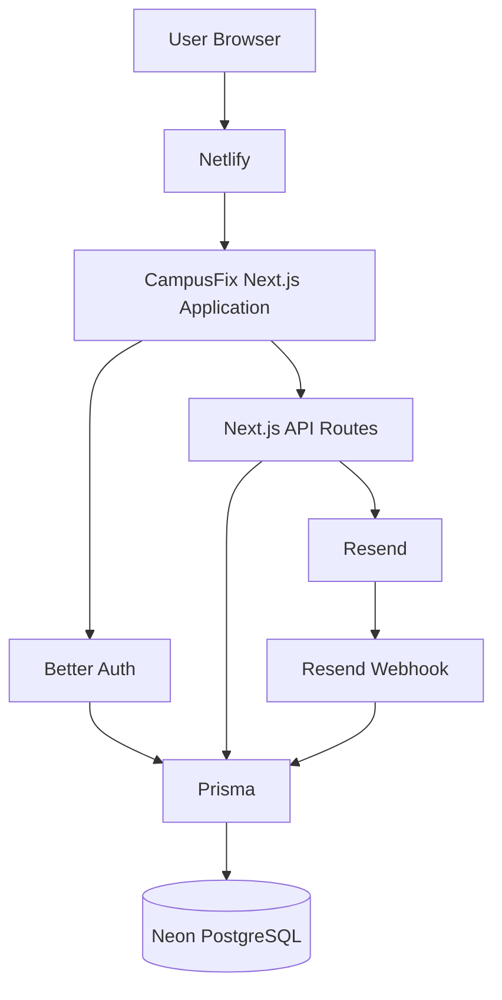
```mermaid
flowchart TB
    USER["User Browser"]

    NETLIFY["Netlify"]
    APP["CampusFix Next.js Application"]

    AUTH["Better Auth"]
    API["Next.js API Routes"]
    PRISMA["Prisma"]

    DB[("Neon PostgreSQL")]

    RESEND["Resend"]
    WEBHOOK["Resend Webhook"]

    USER --> NETLIFY
    NETLIFY --> APP

    APP --> AUTH
    APP --> API

    AUTH --> PRISMA
    API --> PRISMA
    PRISMA --> DB

    API --> RESEND
    RESEND --> WEBHOOK
    WEBHOOK --> PRISMA
```

The deployed architecture separates application hosting from database hosting.

---

# 30. Environment Configuration

Environment variables are used for environment-specific configuration.

Important production variables include:

```text
DATABASE_URL
BETTER_AUTH_URL
NEXT_PUBLIC_APP_URL
BETTER_AUTH_SECRET
```

These values should be configured through the deployment environment rather than committed to Git.

The relationship is:

```text
Environment Variables
        │
        ├── Database connection
        ├── Authentication URL
        ├── Public application URL
        └── Authentication secret
```

Sensitive values must never be included in screenshots or committed to the repository.

---

# 31. Database Management Evidence

The database setup should be demonstrated using terminal output and a database management interface.

Recommended evidence includes:

1. Prisma migration output
2. Prisma seed output
3. PostgreSQL database connection
4. User records
5. Issue records
6. Audit records
7. Status history records
8. Email delivery records

The purpose of the evidence is to demonstrate that the schema was successfully created and that relational records were actually persisted.

---

# 32. Migration Evidence

## Figure A2-01 — Prisma Migration

**Purpose:** Demonstrates successful database migration.

Recommended terminal command:

```bash
npx prisma migrate deploy
```

The screenshot should clearly show the migration being found and successfully applied.

Example evidence:

```text
1 migration found

20260912141001_init

Migration successfully applied
```

**Caption:**

> **Figure A2-01:** Successful Prisma migration deployment against the PostgreSQL database.

### Image

When the screenshot is available, place it here:

```markdown
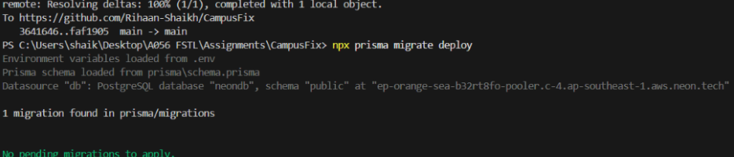
```

---

# 33. Seed Evidence

## Figure A2-02 — Prisma Seed Execution

**Purpose:** Demonstrates successful database seeding.

Recommended terminal command:

```bash
npx prisma db seed
```

The screenshot should show the successful creation of the seeded relational dataset.

The important output includes:

```text
Starting CampusFix database seeding...

Cleared existing database tables.

Created 6 seed users with Better Auth credential accounts.

Seeded 12 relational campus issues with audit logs,
status histories, and email delivery receipts.
```

**Caption:**

> **Figure A2-02:** Successful Prisma seed execution creating the initial CampusFix relational dataset.

### Image

When the screenshot is available, place it here:

```markdown
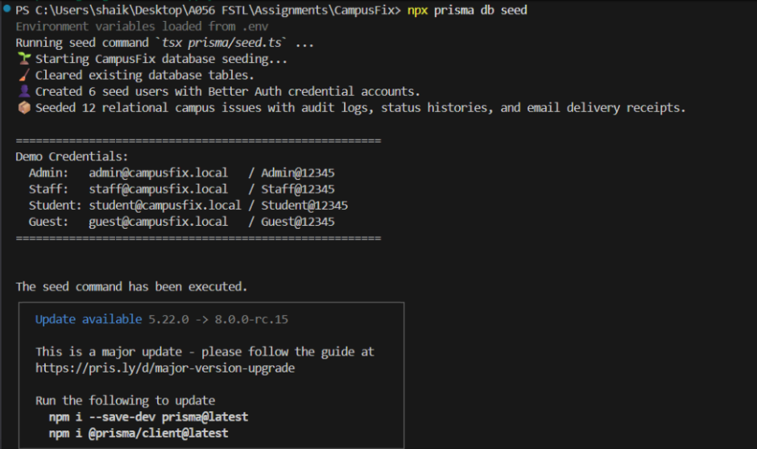
```

---

# 34. Database Persistence Evidence

## Figure A2-03 — Persisted Database Records

**Purpose:** Demonstrates that migration and seed operations resulted in actual persistent database records.

Suitable evidence includes:

- PostgreSQL database management interface
- Prisma Studio
- Neon database interface
- another suitable database management tool

The screenshot should show actual records rather than only the schema definition.

Recommended records include:

```text
User
Issue
Issue Status History
Audit Log
Email Activity
```

**Caption:**

> **Figure A2-03:** Persisted CampusFix records in the PostgreSQL database after migration and seeding.

### Image

When the screenshot is available, place it here:

```markdown
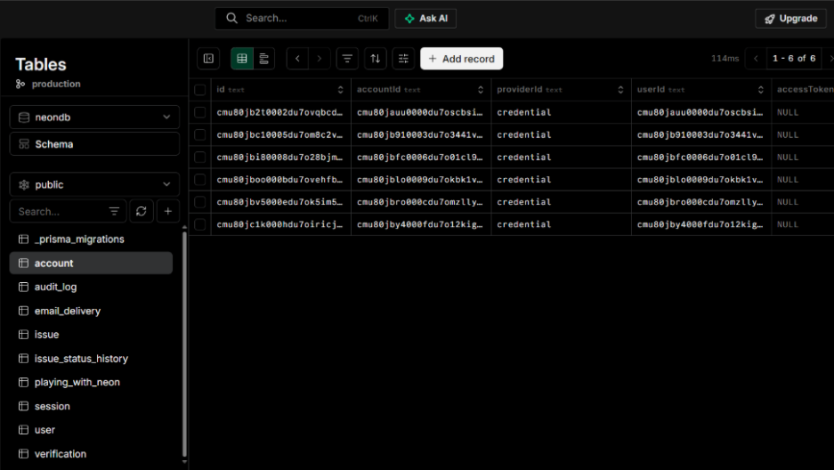
```

---

# 35. Prisma Schema Evidence

## Figure A2-04 — Prisma Schema

**Purpose:** Demonstrates the relational database definition.

Recommended source file:

```text
prisma/schema.prisma
```

The screenshot should show the relevant models and their relationships.

**Caption:**

> **Figure A2-04:** Prisma schema defining the CampusFix PostgreSQL relational model.

### Image

When the screenshot is available, place it here:

```markdown
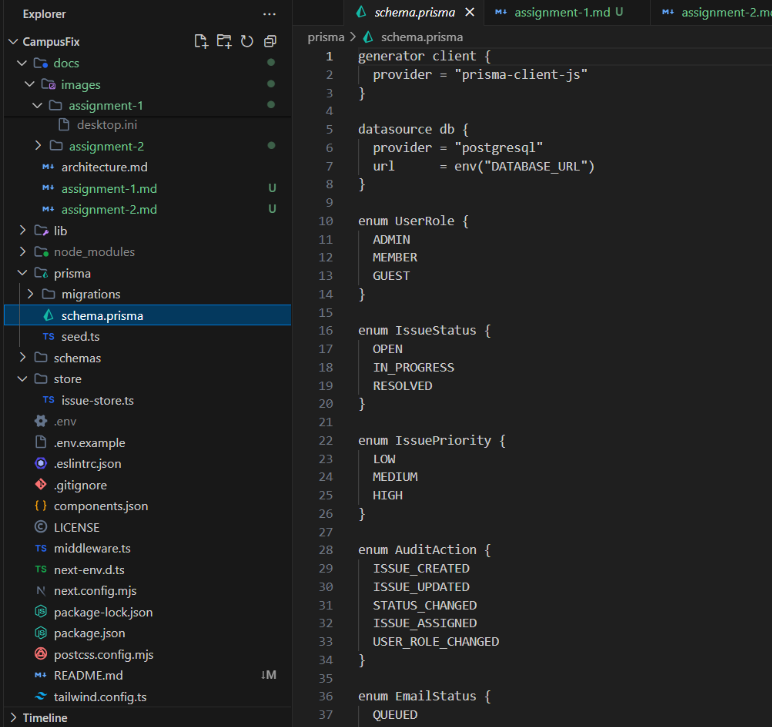
```

---

# 36. API Route Evidence

## Figure A2-05 — API Route Handler

**Purpose:** Demonstrates server-side API processing and authorization.

Relevant API implementation:

```text
/api/issues/[id]
```

The screenshot should ideally demonstrate:

```text
Authentication
Authorization
Request handling
Prisma operation
Response handling
```

**Caption:**

> **Figure A2-05:** Protected API Route Handler responsible for processing CampusFix issue operations.

### Image

When the screenshot is available, place it here:

```markdown
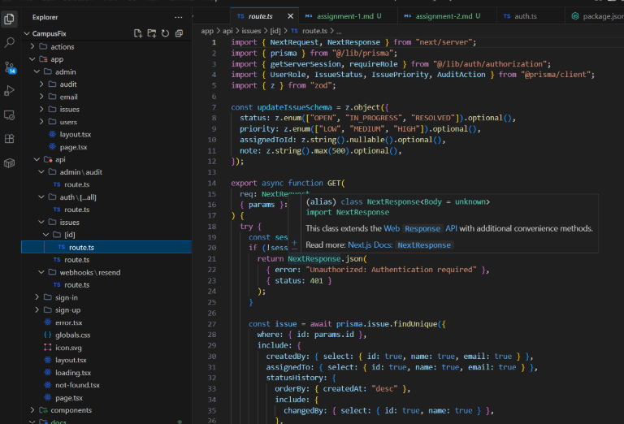
```

---

# 37. React Email Evidence

## Figure A2-06 — React Email Component

**Purpose:** Demonstrates the transactional email implementation.

The screenshot should show the actual React Email component used by CampusFix.

It should preferably show the component structure rather than only the rendered email.

**Caption:**

> **Figure A2-06:** React Email component used to generate transactional CampusFix email content.

### Image

When the screenshot is available, place it here:

```markdown
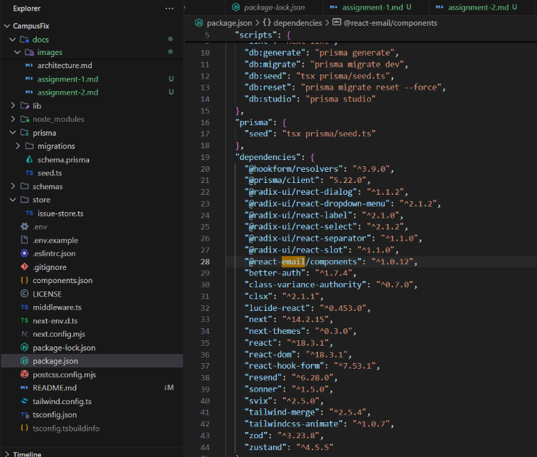
```

---

# 38. Email Delivery Evidence

## Figure A2-07 — Email Delivery Record

**Purpose:** Demonstrates email delivery activity and persistence.

Suitable evidence may include:

```text
Resend delivery event
        +
CampusFix email activity record
```

The screenshot should show delivery status or event information without exposing private credentials or unnecessary personal information.

**Caption:**

> **Figure A2-07:** Email delivery activity recorded by CampusFix after processing the provider event.

### Image

When the screenshot is available, place it here:

```markdown
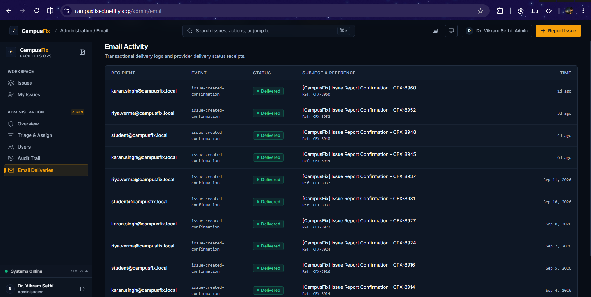
```

---

# 39. Authorization Evidence

## Figure A2-08 — Role-Based Authorization

**Purpose:** Demonstrates that protected administrative operations are restricted by role.

Suitable evidence includes:

- protected admin route
- API authorization code
- authenticated administrative interface
- rejected unauthorized request, where appropriate

The evidence should demonstrate that authorization is performed server-side.

**Caption:**

> **Figure A2-08:** Server-side role authorization protecting administrative CampusFix operations.

### Image

When the screenshot is available, place it here:

```markdown
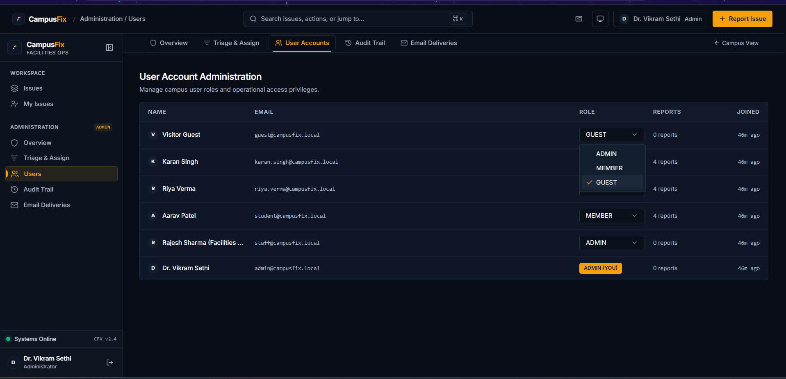
```

---

# 40. Evidence Checklist

The final Assignment 2 evidence set should contain:

| Figure | Evidence | Purpose |
|---|---|---|
| **A2-01** | Prisma migration terminal | Database schema migration |
| **A2-02** | Prisma seed terminal | Seed execution |
| **A2-03** | Database records | Persistent data verification |
| **A2-04** | `schema.prisma` | Relational schema |
| **A2-05** | API route | Server-side processing |
| **A2-06** | React Email component | Email generation |
| **A2-07** | Email delivery record | Delivery persistence |
| **A2-08** | Authorization implementation | RBAC and security |

---

# 41. Evidence and Screenshot Organization

The documentation assets should be stored inside the repository rather than referenced from a local computer.

Recommended structure:

```text
docs/
├── assignment-1.md
├── assignment-2.md
├── architecture.md
│
└── images/
    ├── assignment-1/
    │   ├── a1-01-campusfix-ui.png
    │   ├── a1-02-server-component.png
    │   ├── a1-03-client-component.png
    │   ├── a1-04-zustand.png
    │   ├── a1-05-lighthouse-performance.png
    │   └── a1-06-lighthouse-scores.png
    │
    ├── assignment-2/
    │   ├── a2-01-migration.png
    │   ├── a2-02-seed.png
    │   ├── a2-03-database-records.png
    │   ├── a2-04-prisma-schema.png
    │   ├── a2-05-api-route.png
    │   ├── a2-06-react-email.png
    │   ├── a2-07-email-delivery.png
    │   └── a2-08-authorization.png
    │
    └── architecture/
```

Images are referenced from `assignment-2.md` using relative paths.

For example:

```markdown

```

This keeps the documentation portable and allows the images to render correctly when the repository is viewed on GitHub.

---

# 42. Security Considerations

The database and application architecture contains several security boundaries.

## 42.1 Credentials

Database credentials and authentication secrets are stored in environment variables.

They must not be committed to Git.

---

## 42.2 Authentication

Better Auth is responsible for establishing authenticated sessions.

---

## 42.3 Authorization

Authorization is enforced on the server.

Client-side UI restrictions should not be considered sufficient security controls.

---

## 42.4 Database Access

The browser does not directly connect to PostgreSQL.

The access path is:

```text
Browser
   │
   ▼
Next.js Server
   │
   ▼
Prisma
   │
   ▼
PostgreSQL
```

This keeps database credentials and direct database access outside the browser.

---

## 42.5 Webhook Verification

Resend webhook requests are verified before their events are processed.

---

## 42.6 Webhook Idempotency

Provider event identifiers are used to prevent duplicate processing of repeated webhook events.

---

# 43. Complete Data Flow

The complete CampusFix data flow can be represented as:

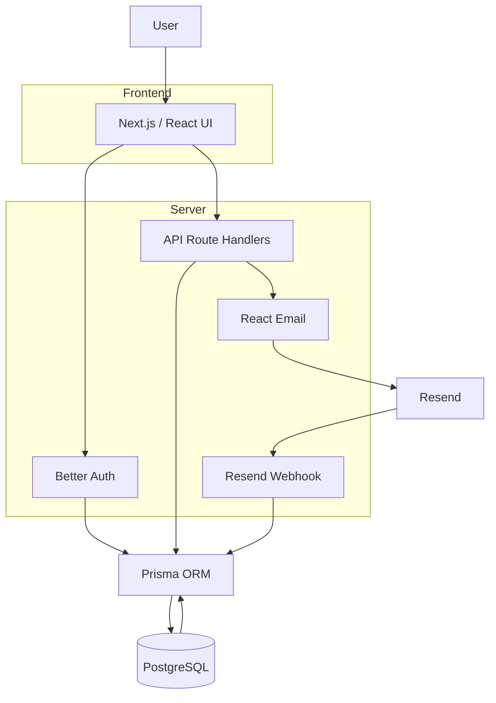
```mermaid
flowchart TB
    USER["User"]

    subgraph FRONTEND["Frontend"]
        UI["Next.js / React UI"]
    end

    subgraph SERVER["Server"]
        AUTH["Better Auth"]
        API["API Route Handlers"]
        EMAIL["React Email"]
        WEBHOOK["Resend Webhook"]
    end

    PRISMA["Prisma ORM"]
    DB[("PostgreSQL")]
    RESEND["Resend"]

    USER --> UI

    UI --> AUTH
    UI --> API

    AUTH --> PRISMA
    API --> PRISMA

    PRISMA --> DB
    DB --> PRISMA

    API --> EMAIL
    EMAIL --> RESEND

    RESEND --> WEBHOOK
    WEBHOOK --> PRISMA
```

The application therefore maintains a clear separation between:

```text
Presentation
     ↓
Authentication / API
     ↓
Application Operations
     ↓
Prisma ORM
     ↓
PostgreSQL
```

while the email subsystem operates as an external delivery integration with a verified webhook return path.

---

# 44. End-to-End System Sequence

A complete issue workflow can be summarized as:

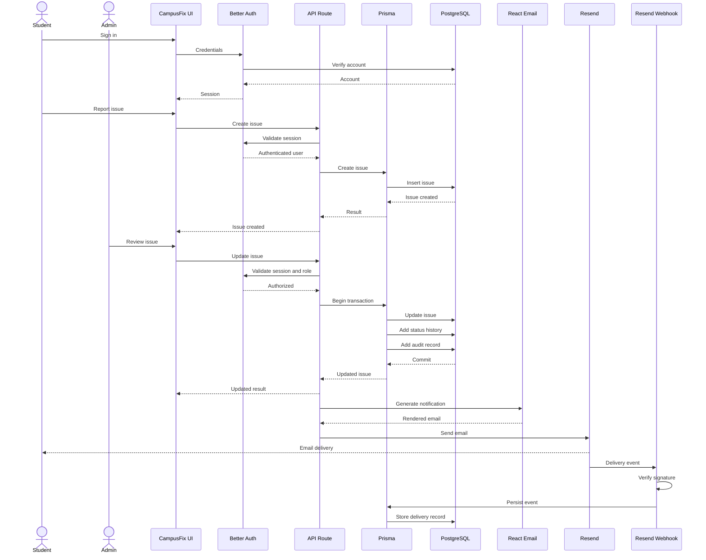
```mermaid
sequenceDiagram
    actor Student
    actor Admin

    participant UI as CampusFix UI
    participant Auth as Better Auth
    participant API as API Route
    participant Prisma as Prisma
    participant DB as PostgreSQL
    participant Email as React Email
    participant Resend
    participant Webhook as Resend Webhook

    Student->>UI: Sign in
    UI->>Auth: Credentials
    Auth->>DB: Verify account
    DB-->>Auth: Account
    Auth-->>UI: Session

    Student->>UI: Report issue
    UI->>API: Create issue
    API->>Auth: Validate session
    Auth-->>API: Authenticated user
    API->>Prisma: Create issue
    Prisma->>DB: Insert issue
    DB-->>Prisma: Issue created
    Prisma-->>API: Result
    API-->>UI: Issue created

    Admin->>UI: Review issue
    UI->>API: Update issue
    API->>Auth: Validate session and role
    Auth-->>API: Authorized

    API->>Prisma: Begin transaction
    Prisma->>DB: Update issue
    Prisma->>DB: Add status history
    Prisma->>DB: Add audit record
    DB-->>Prisma: Commit
    Prisma-->>API: Updated issue
    API-->>UI: Updated result

    API->>Email: Generate notification
    Email-->>API: Rendered email
    API->>Resend: Send email
    Resend-->>Student: Email delivery

    Resend->>Webhook: Delivery event
    Webhook->>Webhook: Verify signature
    Webhook->>Prisma: Persist event
    Prisma->>DB: Store delivery record
```

This sequence illustrates the relationship between authentication, issue processing, database persistence, audit history, and email delivery.

---

# 45. Architectural Summary

CampusFix can be viewed as five connected layers:

```text
┌───────────────────────────────────────────────┐
│                  PRESENTATION                 │
│              Next.js / React UI               │
├───────────────────────────────────────────────┤
│              AUTHENTICATION                   │
│                 Better Auth                   │
├───────────────────────────────────────────────┤
│              APPLICATION API                  │
│          Next.js Route Handlers               │
├───────────────────────────────────────────────┤
│                DATA ACCESS                    │
│                   Prisma                      │
├───────────────────────────────────────────────┤
│                PERSISTENCE                    │
│                PostgreSQL                     │
└───────────────────────────────────────────────┘
```

The email subsystem connects to the server layer:

```text
CampusFix
    │
    ▼
React Email
    │
    ▼
Resend
    │
    ▼
Recipient

Resend
    │
    ▼
Verified Webhook
    │
    ▼
Prisma
    │
    ▼
PostgreSQL
```

This architecture provides clear boundaries for application logic, authentication, database access, persistent records, and external email delivery.

---

# 46. Conclusion

CampusFix implements a relational PostgreSQL database architecture using Prisma as the application's data-access layer.

The database architecture provides relationships between users, issues, issue history, audit activity, and email-related records. Prisma migrations provide a reproducible mechanism for creating and updating the database schema, while `prisma/seed.ts` provides a controlled way to populate a demonstration dataset.

The application's authorization architecture separates authentication from authorization. Better Auth establishes authenticated sessions, while protected server-side API operations perform the required authorization checks before modifying persistent data.

Issue updates are handled through server-side API routes and Prisma transactions, allowing the primary issue record and related status-history and audit records to remain consistent.

The email subsystem uses React Email for generating structured email content and Resend for delivery. Resend webhook events are verified before processing, and provider event identifiers provide idempotency against duplicate webhook deliveries.

The resulting architecture can be summarized as:

```text
                    CAMPUSFIX
                        │
        ┌───────────────┼───────────────┐
        │               │               │
        ▼               ▼               ▼
 Authentication     API Layer      Email System
 Better Auth        Next.js        React Email
        │               │               │
        │               ▼               ▼
        │            Prisma           Resend
        │               │               │
        └───────────────┼───────────────┘
                        ▼
                   PostgreSQL
```

This structure provides a clear separation of responsibilities while maintaining persistent, traceable, and secure application data.

---

# 47. Final Evidence Checklist

Before submitting Assignment 2, verify that the repository contains:

```text
[ ] prisma/schema.prisma

[ ] prisma/seed.ts

[ ] prisma/migrations/

[ ] API route handlers

[ ] React Email components

[ ] Resend webhook implementation

[ ] Successful migration terminal screenshot

[ ] Successful seed terminal screenshot

[ ] Database management screenshot showing persisted records

[ ] Prisma schema screenshot

[ ] API route screenshot

[ ] React Email screenshot

[ ] Email delivery evidence

[ ] Authorization evidence

[ ] Sensitive credentials removed/redacted from screenshots
```

---

# 48. Figure List

| Figure | Description |
|---|---|
| **A2-01** | Successful Prisma migration |
| **A2-02** | Successful Prisma seed execution |
| **A2-03** | Persisted PostgreSQL records |
| **A2-04** | Prisma schema |
| **A2-05** | Protected API Route Handler |
| **A2-06** | React Email component |
| **A2-07** | Email delivery record |
| **A2-08** | Server-side authorization |

---

# 49. References

1. CampusFix source repository.
2. `prisma/schema.prisma`
3. `prisma/seed.ts`
4. Prisma migration history.
5. Next.js App Router implementation.
6. Better Auth authentication implementation.
7. CampusFix API Route Handlers.
8. React Email implementation.
9. Resend webhook implementation.
10. PostgreSQL database used by the CampusFix application.

---

> **Documentation note:** Screenshots should be added to `docs/images/assignment-2/` and referenced using repository-relative Markdown paths. Credentials, authentication secrets, database connection strings, and other sensitive values must be redacted before screenshots are committed to a public repository.