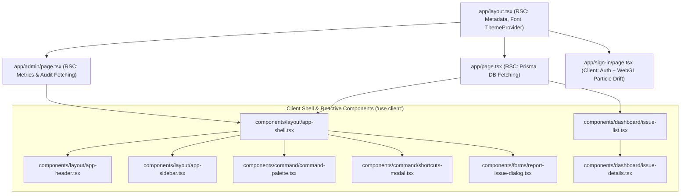

# CampusFix UI/UX Architecture

This document outlines the frontend design system, token layer, component hierarchy, accessibility compliance, and motion systems implemented across CampusFix.

---

## 1. Design Token & Theme Architecture

CampusFix utilizes a semantic theme system powered by CSS custom properties and Tailwind CSS. The application defaults to **LIGHT** theme (`defaultTheme="light"`) while providing seamless dark mode and system preference synchronization via `next-themes`.

### 1.1 Color Palette Specifications

#### Light Palette (Default)
| Token | Hex / HSL Value | Semantic Role |
| :--- | :--- | :--- |
| `--background` | `#F7F8FA` (`220 20% 97.6%`) | Base canvas background |
| `--card` / `--surface` | `#FFFFFF` (`0 0% 100%`) | Primary elevated surface cards |
| `--secondary` / `--muted` | `#F1F4F7` (`214 25% 96%`) | Subtle surface backgrounds |
| `--border` | `#D9E0E7` (`212 23% 88%`) | Delimiting structural borders |
| `--foreground` | `#17243A` (`218 43% 16%`) | Primary deep ink text |
| `--primary` / `--brand` | `#F59E0B` (`38 92% 50%`) | Primary brand orange action accent |
| `--brand-hover` | `#D97706` (`32 95% 44%`) | Darker brand orange for hover states |
| `--deep-navy` | `#0E1728` (`219 48% 11%`) | High-contrast brand navy |
| `--success` | `#0F9F75` (`163 83% 34%`) | Resolved status / healthy systems |
| `--warning` | `#D97706` (`32 95% 44%`) | Medium priority / cautionary alert |
| `--danger` | `#DC3F45` (`358 68% 55%`) | High priority / destructive actions |

#### Dark Palette
| Token | Hex / HSL Value | Semantic Role |
| :--- | :--- | :--- |
| `--background` | `#080D16` (`219 47% 6%`) | Deep obsidian canvas |
| `--card` / `--surface` | `#0E1624` (`217 44% 10%`) | Card background |
| `--popover` | `#131E2D` (`215 40% 13%`) | Elevated dropdowns & drawers |
| `--border` | `#243145` (`216 31% 21%`) | Low-contrast dark borders |
| `--foreground` | `#F5F7FA` (`216 33% 97%`) | Crisp primary text |
| `--muted-foreground` | `#A9B4C4` (`216 20% 72%`) | Readable secondary text |
| `--primary` / `--brand` | `#F59E0B` (`38 92% 50%`) | Radiant brand orange accent |
| `--accent-blue` | `#4F8CFF` (`219 100% 65%`) | In-progress status / highlights |
| `--success` | `#29C58B` (`158 66% 47%`) | Resolved status indicator |

---

## 2. Component Hierarchy & RSC Boundaries

CampusFix enforces a strict separation between React Server Components (RSC) and Client Components to optimize payload sizes and hydration efficiency:

---

## 3. Motion System & Micro-Interactions

The motion system is designed for high-performance operational ergonomics:

1. **Easing Curves**:
   - Spring curve: `cubic-bezier(0.16, 1, 0.3, 1)` for snappy, organic expansion and sheet slides.
   - Hover transition: `150ms – 220ms` for immediate visual responsiveness.
2. **Interactive States**:
   - `hover-lift`: Cards lift `-2px` on hover with a soft shadow bloom.
   - `btn-tactile`: Micro-compression (`scale(0.98)`) on click/tap.
   - `radar-dot`: Pulsing live radar beacon on `OPEN` and `IN_PROGRESS` badges and the "Systems Online" telemetry monitor.
3. **Reduced-Motion Compliance**:
   - A `@media (prefers-reduced-motion: reduce)` media query clamps all animation durations to `0.01ms`, completely disabling decorative motion for sensitive users.

---

## 4. Keyboard Shortcuts & Global Command Palette

CampusFix provides full keyboard operability:

| Key Binding | Functionality | Scope |
| :--- | :--- | :--- |
| `Cmd/Ctrl + K` | Opens global Command Palette | Anywhere in the application |
| `/` | Direct focus to issue search / command palette | Anywhere outside input focus |
| `?` | Opens the Keyboard Shortcuts Reference Guide | Global |
| `[` | Toggles sidebar collapse / expansion | Desktop viewports |
| `n` | Opens the Report New Issue dialog | Global |
| `ESC` | Closes any active drawer, dialog, or command palette | Global |

---

## 5. WebGL Particle Drift Integration

Authentication pages (`/sign-in`, `/sign-up`) feature an embedded WebGL interactive particle canvas representing campus infrastructure telemetry nodes:
- Interactive pointer repulsion and node interconnectivity.
- Synchronized color mapping with the active theme:
  - **Light mode**: `#F7F8FA` background, `#94A3B8` base particles, `#F59E0B` brand orange accents.
  - **Dark mode**: `#080D16` background, `#64748B` base particles, `#F59E0B` brand orange accents.
- Dynamic performance throttling ensuring zero impact on form input responsiveness.
